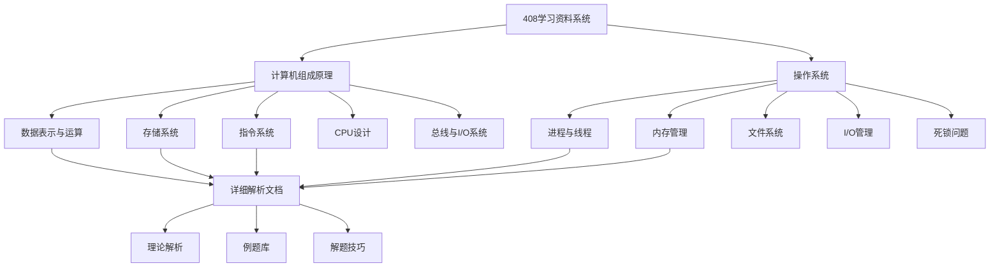
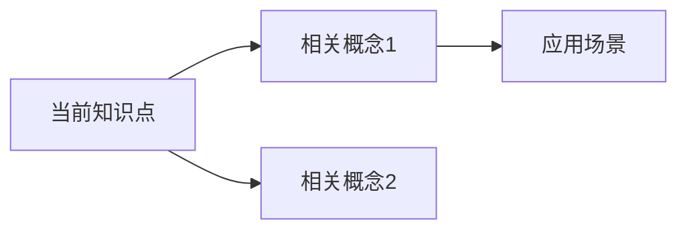
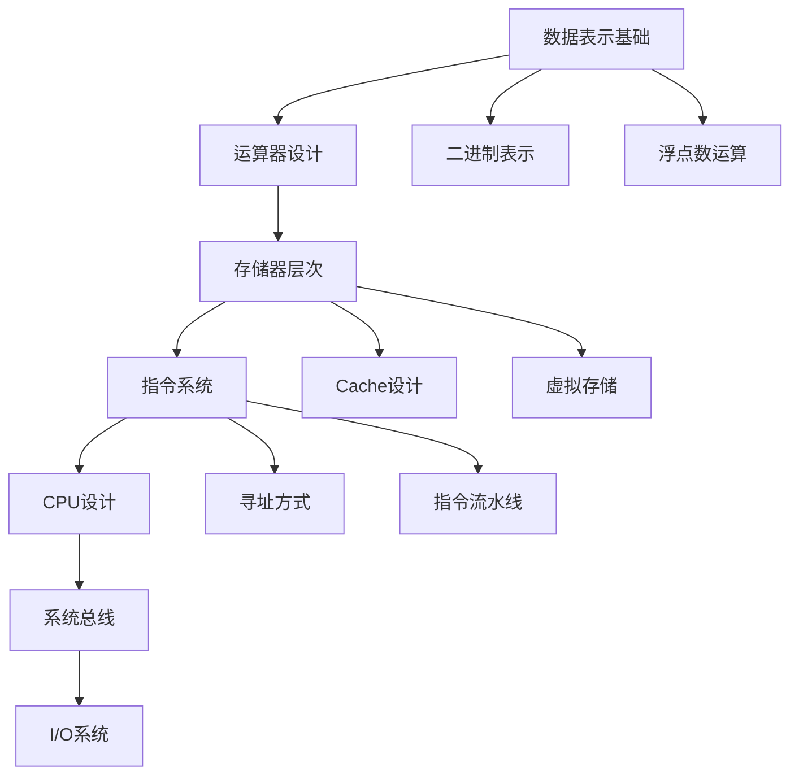
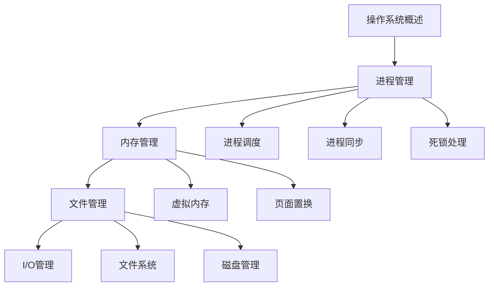

# 408考试学习资料系统设计

## 1. 项目概述

### 1.1 项目目标
构建一个系统化的408考试学习资料库，专注于计算机组成原理和操作系统中的难点问题。通过结构化的文档组织、详细的知识点解析和配套例题，帮助考生高效掌握考试重难点。

### 1.2 核心功能
- 难点知识点识别与分类
- 详细理论解析文档
- 配套例题与解答
- 层次化文档结构
- 知识点关联映射

## 2. 系统架构

### 2.1 整体架构设计



### 2.2 文档层次结构

```
408-exam-materials/
├── README.md                           # 总体学习指南
├── outline/
│   ├── computer-organization.md        # 计算机组成原理大纲
│   └── operating-systems.md           # 操作系统大纲
├── computer-organization/             # 计算机组成原理
│   ├── data-representation/           # 数据表示与运算
│   ├── memory-hierarchy/              # 存储系统层次结构
│   ├── instruction-system/            # 指令系统设计
│   ├── cpu-design/                   # CPU设计与控制
│   └── bus-io-system/                # 总线与I/O系统
└── operating-systems/                # 操作系统
    ├── process-thread/               # 进程与线程管理
    ├── memory-management/            # 内存管理
    ├── file-system/                  # 文件系统
    ├── io-management/                # I/O管理
    └── deadlock/                     # 死锁问题
```

## 3. 难点知识模块设计

### 3.1 计算机组成原理难点模块

#### 3.1.1 数据表示与运算模块

| 难点主题 | 重要程度 | 文档名称 | 包含内容 |
|---------|---------|----------|----------|
| 浮点数表示 | ★★★★★ | floating-point.md | IEEE754标准、精度分析、运算规则 |
| 定点数运算 | ★★★★☆ | fixed-point.md | 补码运算、溢出检测、移位操作 |
| 数据校验 | ★★★☆☆ | data-verification.md | 奇偶校验、海明码、循环冗余校验 |

#### 3.1.2 存储系统模块

| 难点主题 | 重要程度 | 文档名称 | 包含内容 |
|---------|---------|----------|----------|
| Cache设计 | ★★★★★ | cache-design.md | 映射方式、替换算法、写策略 |
| 虚拟存储 | ★★★★★ | virtual-memory.md | 地址映射、页面置换、TLB机制 |
| 存储器层次 | ★★★★☆ | memory-hierarchy.md | 性能分析、局部性原理、优化策略 |

#### 3.1.3 指令系统模块

| 难点主题 | 重要程度 | 文档名称 | 包含内容 |
|---------|---------|----------|----------|
| 寻址方式 | ★★★★☆ | addressing-modes.md | 各种寻址方式、有效地址计算 |
| RISC vs CISC | ★★★☆☆ | instruction-sets.md | 指令集特点、性能对比 |
| 指令流水线 | ★★★★★ | pipeline.md | 流水线冲突、分支预测、性能分析 |

#### 3.1.4 CPU设计模块

| 难点主题 | 重要程度 | 文档名称 | 包含内容 |
|---------|---------|----------|----------|
| 控制器设计 | ★★★★★ | control-unit.md | 硬布线控制、微程序控制 |
| 数据通路 | ★★★★☆ | datapath.md | 单周期、多周期、流水线数据通路 |
| 异常处理 | ★★★☆☆ | exception-handling.md | 中断机制、异常分类、处理流程 |

### 3.2 操作系统难点模块

#### 3.2.1 进程与线程模块

| 难点主题 | 重要程度 | 文档名称 | 包含内容 |
|---------|---------|----------|----------|
| 进程调度 | ★★★★★ | process-scheduling.md | 调度算法、性能指标、实时调度 |
| 进程同步 | ★★★★★ | process-synchronization.md | 信号量、管程、经典同步问题 |
| 线程实现 | ★★★☆☆ | thread-implementation.md | 用户级线程、内核级线程 |

#### 3.2.2 内存管理模块

| 难点主题 | 重要程度 | 文档名称 | 包含内容 |
|---------|---------|----------|----------|
| 虚拟内存 | ★★★★★ | virtual-memory-os.md | 分页、分段、段页式管理 |
| 页面置换 | ★★★★★ | page-replacement.md | LRU、FIFO、时钟算法 |
| 内存分配 | ★★★★☆ | memory-allocation.md | 动态分配、碎片处理、伙伴算法 |

#### 3.2.3 文件系统模块

| 难点主题 | 重要程度 | 文档名称 | 包含内容 |
|---------|---------|----------|----------|
| 文件分配 | ★★★★☆ | file-allocation.md | 连续、链接、索引分配方式 |
| 目录结构 | ★★★☆☆ | directory-structure.md | 目录实现、路径解析 |
| 磁盘调度 | ★★★★☆ | disk-scheduling.md | FCFS、SSTF、SCAN、C-SCAN |

#### 3.2.4 死锁问题模块

| 难点主题 | 重要程度 | 文档名称 | 包含内容 |
|---------|---------|----------|----------|
| 死锁检测 | ★★★★★ | deadlock-detection.md | 资源分配图、银行家算法 |
| 死锁预防 | ★★★★☆ | deadlock-prevention.md | 破坏死锁条件、预防策略 |

## 4. 文档模板标准

### 4.1 难点文档结构模板

每个难点文档应包含以下标准结构：

```markdown
# [难点名称]

## 1. 知识点概述
- 定义和基本概念
- 在考试中的重要性
- 与其他知识点的关联

## 2. 理论基础
- 核心原理详解
- 重要公式和定理
- 关键算法步骤

## 3. 重难点分析
- 常见误区和易错点
- 深入理解要点
- 记忆技巧

## 4. 典型例题解析
- 例题1：基础应用
- 例题2：综合分析
- 例题3：难点突破

## 5. 解题方法总结
- 解题思路框架
- 关键步骤提炼
- 时间分配建议

## 6. 相关真题练习
- 历年真题选编
- 模拟题推荐
- 自测练习

## 7. 知识点关联图


```

### 4.2 例题解析标准格式

```markdown
### 例题：[题目类型]

**题目描述：**
[完整题目内容]

**解题思路：**
1. 问题分析
2. 方法选择
3. 步骤规划

**详细解答：**
[步骤化解答过程]

**关键点总结：**
- 核心概念应用
- 易错点提醒
- 解题技巧

**相关变式：**
[类似题型的变化形式]
```

## 5. 学习路径设计

### 5.1 计算机组成原理学习路径



### 5.2 操作系统学习路径



## 6. 文档生成规范

### 6.1 文件命名规范

- 使用英文小写字母和连字符
- 体现内容主题的关键词
- 保持简洁且具有描述性

例如：
- `floating-point-arithmetic.md`
- `cache-mapping-strategies.md` 
- `process-scheduling-algorithms.md`

### 6.2 内容组织原则

1. **循序渐进**：从基础概念到高级应用
2. **重点突出**：标注考试频率和重要程度
3. **实例丰富**：每个概念都配备典型例题
4. **关联清晰**：建立知识点间的逻辑关系
5. **便于复习**：提供快速回顾的要点总结

### 6.3 图表使用标准

- 使用Mermaid语法绘制流程图和关系图
- 采用表格整理对比性内容
- 利用代码块展示算法步骤
- 通过列表突出要点和步骤

## 7. 质量保证机制

### 7.1 内容质量标准

- **准确性**：所有理论解释和例题解答经过验证
- **完整性**：涵盖考试大纲要求的所有难点
- **实用性**：提供可操作的解题方法和技巧
- **时效性**：基于最新考试趋势和真题分析

### 7.2 更新维护机制

- 定期更新真题分析
- 根据考试反馈调整重点
- 持续优化解题方法
- 补充新的典型例题

## 8. 使用指导

### 8.1 学习建议

1. **制定学习计划**：按照学习路径逐步推进
2. **重视理论基础**：深入理解核心概念
3. **多做练习**：通过例题巩固知识点
4. **总结归纳**：建立知识框架和思维导图
5. **模拟测试**：定期检验学习效果

### 8.2 复习策略

- 使用难点文档进行专项突破
- 利用关联图复习知识体系
- 重点练习高频考点
- 总结解题模板和技巧

通过这个系统化的设计，能够有效组织408考试中计算机组成原理和操作系统的重难点内容，为考生提供结构清晰、内容详实的学习资料，显著提高备考效率和考试成绩。