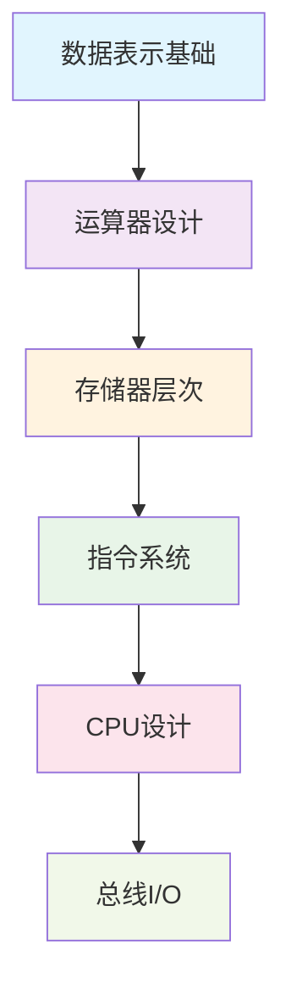
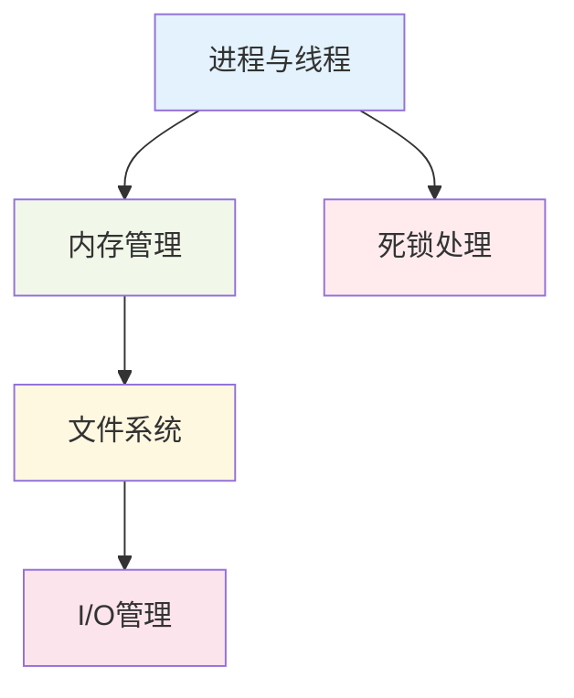

# 408考试学习资料系统

## 🎯 项目概述

本学习资料系统专门为408计算机学科专业基础综合考试打造，深度聚焦**计算机组成原理**和**操作系统**中的重难点知识。通过系统化的知识梳理、详细的理论解析和丰富的例题练习，帮助考生高效突破考试难点，显著提升备考效率。

### 核心特色
- 🔍 **精准定位难点**：基于历年真题分析，识别高频考点和易错点
- 📚 **深度理论解析**：每个难点都提供透彻的原理讲解和记忆技巧
- 💡 **丰富例题库**：配备典型例题、解题思路和相关变式
- 🗂️ **层次化组织**：结构清晰的文档体系，便于查找和复习
- 🔗 **知识点关联**：建立知识网络，帮助形成完整的知识体系

## 📊 学习效果统计

| 知识模块 | 难点数量 | 例题数量 | 预计学习时间 | 重要程度 |
|---------|---------|---------|-------------|---------|
| 计算机组成原理 | 12个 | 36+ | 40小时 | ⭐⭐⭐⭐⭐ |
| 操作系统 | 11个 | 33+ | 35小时 | ⭐⭐⭐⭐⭐ |

## 🗂️ 资料结构

```
408-exam-materials/
├── README.md                           # 总体学习指南（本文档）
├── outline/                           # 学习大纲
│   ├── computer-organization.md        # 计算机组成原理大纲
│   └── operating-systems.md           # 操作系统大纲
├── computer-organization/             # 计算机组成原理
│   ├── data-representation/           # 数据表示与运算
│   ├── memory-hierarchy/              # 存储系统层次结构
│   ├── instruction-system/            # 指令系统设计
│   ├── cpu-design/                   # CPU设计与控制
│   └── bus-io-system/                # 总线与I/O系统
└── operating-systems/                # 操作系统
    ├── process-thread/               # 进程与线程管理
    ├── memory-management/            # 内存管理
    ├── file-system/                  # 文件系统
    ├── io-management/                # I/O管理
    └── deadlock/                     # 死锁问题
```

## 🚀 快速开始

### 1. 制定学习计划
建议按照以下顺序进行学习：

#### 计算机组成原理学习路径


#### 操作系统学习路径


### 2. 使用学习资料

1. **查看大纲**：先阅读 `outline/` 中的大纲文档，了解整体框架
2. **学习难点**：进入具体模块文件夹，按顺序学习各个难点
3. **练习巩固**：完成每个难点文档中的例题和练习
4. **总结回顾**：利用知识关联图进行系统复习

### 3. 文档阅读指南

每个难点文档都采用统一的结构：
- **知识点概述**：快速了解重要性和关联性
- **理论基础**：深入理解核心原理
- **重难点分析**：掌握关键要点和易错点
- **典型例题解析**：通过实例加深理解
- **解题方法总结**：形成解题思路模板
- **相关真题练习**：检验学习效果

## 📈 重难点分布

### 计算机组成原理重点模块

| 模块 | 核心难点 | 分值占比 | 难度等级 |
|------|---------|---------|---------|
| 数据表示与运算 | 浮点数运算、补码运算 | 15% | ⭐⭐⭐⭐ |
| 存储系统 | Cache设计、虚拟存储 | 25% | ⭐⭐⭐⭐⭐ |
| 指令系统 | 寻址方式、流水线 | 20% | ⭐⭐⭐⭐ |
| CPU设计 | 控制器、数据通路 | 25% | ⭐⭐⭐⭐⭐ |
| 总线I/O | 中断处理、DMA | 15% | ⭐⭐⭐ |

### 操作系统重点模块

| 模块 | 核心难点 | 分值占比 | 难度等级 |
|------|---------|---------|---------|
| 进程与线程 | 进程调度、同步机制 | 30% | ⭐⭐⭐⭐⭐ |
| 内存管理 | 虚拟内存、页面置换 | 25% | ⭐⭐⭐⭐⭐ |
| 文件系统 | 文件分配、磁盘调度 | 20% | ⭐⭐⭐⭐ |
| I/O管理 | 设备管理、缓冲技术 | 15% | ⭐⭐⭐ |
| 死锁问题 | 死锁检测、预防策略 | 10% | ⭐⭐⭐⭐ |

## 🎯 学习建议

### 阶段性学习策略

#### 第一阶段：基础建构（建议时长：2-3周）
- 重点学习数据表示、基本存储概念、进程基础
- 目标：建立扎实的理论基础
- 方法：理论学习为主，适量练习

#### 第二阶段：难点攻坚（建议时长：3-4周）
- 重点攻克Cache设计、流水线、进程调度、虚拟内存
- 目标：突破核心难点
- 方法：深度学习 + 大量练习

#### 第三阶段：综合提升（建议时长：2-3周）
- 系统复习所有模块，重点练习综合题
- 目标：形成完整知识体系
- 方法：模拟测试 + 查漏补缺

### 高效学习技巧

1. **制作思维导图**：将知识点的关联关系可视化
2. **错题集整理**：记录易错点和解题心得
3. **定期回顾**：采用间隔复习法巩固记忆
4. **模拟练习**：使用真题进行实战演练
5. **讨论交流**：与同学探讨疑难问题

## 🔗 相关资源

### 推荐教材
- 《计算机组成原理》- 唐朔飞
- 《操作系统概念》- Abraham Silberschatz
- 《王道考研系列》- 计算机组成原理、操作系统

### 在线资源
- 中国大学MOOC相关课程
- 各大高校公开课
- 专业论坛和学习社区

## 📞 使用说明

### 文档约定
- ⭐⭐⭐⭐⭐：极其重要，必须掌握
- ⭐⭐⭐⭐：重要，需要熟练掌握
- ⭐⭐⭐：一般重要，需要理解
- 🔥：高频考点
- ⚠️：易错点提醒
- 💡：解题技巧
- 📝：例题练习

### 符号说明
- `代码块`：具体的算法、公式或关键术语
- **粗体**：重要概念或关键要点
- *斜体*：需要特别注意的内容

---

## 📈 学习进度追踪

建议使用以下表格追踪学习进度：

| 模块 | 开始日期 | 完成日期 | 掌握程度 | 备注 |
|------|---------|---------|---------|------|
| 数据表示与运算 | | | □□□□□ | |
| 存储系统 | | | □□□□□ | |
| 指令系统 | | | □□□□□ | |
| CPU设计 | | | □□□□□ | |
| 进程与线程 | | | □□□□□ | |
| 内存管理 | | | □□□□□ | |
| 文件系统 | | | □□□□□ | |
| 死锁问题 | | | □□□□□ | |

**掌握程度说明**：☑️ 表示已掌握，□ 表示待掌握

祝您学习顺利，考试成功！🎉