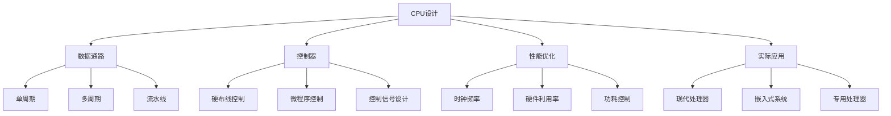

# CPU设计与控制

## 1. 知识点概述

### 定义和基本概念
CPU设计是计算机组成原理的核心内容，涉及处理器的结构设计、控制逻辑实现和数据通路组织。CPU作为计算机的"大脑"，负责指令的获取、解析和执行，其设计直接影响计算机的性能和功能。

### 在考试中的重要性 ⭐⭐⭐⭐⭐
- **核心考点**：408考试计算机组成原理的重中之重
- **分值占比**：通常占CPU相关内容80%以上的分值
- **题型多样**：设计分析、时序图绘制、控制信号分析
- **综合性强**：整合指令系统、存储系统等多个模块

### 与其他知识点的关联
- 基于指令系统架构设计
- 与存储系统紧密配合
- 关联ALU和寄存器设计
- 影响整体系统性能

## 2. 理论基础

### CPU基本组成

#### 运算器（ALU）
- **算术逻辑单元**：执行算术和逻辑运算
- **寄存器组**：存储操作数和运算结果
- **状态寄存器**：记录运算状态信息

#### 控制器
- **程序计数器（PC）**：指向下一条要执行的指令
- **指令寄存器（IR）**：存储当前正在执行的指令
- **控制逻辑**：产生各种控制信号

#### 内部总线
- **数据总线**：传输数据信息
- **地址总线**：传输地址信息
- **控制总线**：传输控制信号

### 指令执行周期

#### 经典指令周期
1. **取指（Fetch）**：从内存读取指令到IR
2. **译码（Decode）**：分析指令操作码和操作数
3. **执行（Execute）**：执行指令规定的操作
4. **存储（Store）**：将结果写回内存或寄存器

#### 详细执行步骤
```
1. PC → MAR（地址传送）
2. M[MAR] → MDR（取指令）
3. MDR → IR（指令传送）
4. PC + 1 → PC（修改PC）
5. 指令译码
6. 计算操作数地址
7. 取操作数
8. 执行运算
9. 存储结果
```

## 3. 数据通路设计 🔥

### 3.1 单周期数据通路

#### 设计原理
所有指令都在一个时钟周期内完成，时钟周期由最慢的指令决定。

#### 关键组件
- **指令存储器**：存储程序指令
- **寄存器文件**：通用寄存器组
- **ALU**：算术逻辑运算单元
- **数据存储器**：存储程序数据
- **多路选择器**：选择数据路径

#### 数据通路结构
```
[指令存储器] → [指令] → [控制单元]
                ↓
[PC] → [加法器] → [下一PC]
       ↓
[寄存器文件] → [ALU] → [数据存储器]
       ↑              ↓
    [写回数据] ← [结果选择器]
```

#### 优缺点分析
**优点**：
- 实现简单，控制逻辑相对简单
- 每条指令执行时间固定
- 易于理解和设计

**缺点**：
- 时钟周期长，性能较低
- 硬件利用率不高
- 功耗相对较大

### 3.2 多周期数据通路

#### 设计原理
将指令执行分解为多个时钟周期，不同指令可以使用不同的周期数。

#### 状态转换
```
取指 → 译码 → 执行 → 访存 → 写回
 ↓      ↓      ↓      ↓      ↓
1周期  1周期   1-2周期 0-1周期 0-1周期
```

#### 控制状态机
```
S0: 取指状态
    IR ← M[PC]
    PC ← PC + 4

S1: 译码状态
    A ← Rs, B ← Rt
    ALUOut ← PC + (sign-extend(offset) << 2)

S2-S9: 执行状态（根据指令类型分支）
    R型指令：ALUOut ← A op B
    I型指令：ALUOut ← A + sign-extend(immediate)
    分支指令：if (A == B) PC ← ALUOut
```

#### 优缺点分析
**优点**：
- 时钟周期短，平均性能较好
- 硬件资源共享，成本较低
- 不同指令优化执行时间

**缺点**：
- 控制逻辑复杂
- 需要状态机设计
- 调试相对困难

### 3.3 流水线数据通路

#### 设计原理
将指令执行过程分解为多个阶段，多条指令的不同阶段并行执行。

#### 五段流水线结构
```
IF段：[PC] → [指令存储器] → [IF/ID寄存器]
ID段：[IF/ID] → [寄存器文件] → [ID/EX寄存器]
EX段：[ID/EX] → [ALU] → [EX/MEM寄存器]
MEM段：[EX/MEM] → [数据存储器] → [MEM/WB寄存器]
WB段：[MEM/WB] → [寄存器文件]
```

#### 流水线寄存器
- **IF/ID**：存储指令和PC+4
- **ID/EX**：存储寄存器数据和控制信号
- **EX/MEM**：存储ALU结果和存储器控制信号
- **MEM/WB**：存储存储器数据和写回控制信号

## 4. 控制器设计 🔥

### 4.1 硬布线控制

#### 设计原理
使用组合逻辑电路根据指令的操作码和当前状态直接产生控制信号。

#### 控制信号生成
```
控制信号 = f(操作码, 功能码, 状态位)

例如：
RegWrite = R型指令 + Load指令
MemRead = Load指令
MemWrite = Store指令
Branch = BEQ指令 + BNE指令
ALUOp = f(操作码)
```

#### 主要控制信号

| 控制信号 | 功能说明 |
|---------|----------|
| RegWrite | 寄存器写使能 |
| RegDst | 写寄存器地址选择 |
| ALUSrc | ALU输入源选择 |
| MemRead | 存储器读使能 |
| MemWrite | 存储器写使能 |
| MemtoReg | 写回数据源选择 |
| PCSrc | PC更新源选择 |
| Jump | 跳转指令标志 |

#### 优缺点分析
**优点**：
- 执行速度快，无额外延迟
- 硬件实现直接
- 适合简单指令集

**缺点**：
- 设计复杂度高
- 不易修改和扩展
- 对复杂指令集支持困难

### 4.2 微程序控制

#### 设计原理
将每条机器指令的执行过程编写成一个微程序，存储在控制存储器中。

#### 微指令格式

**水平型微指令**：
```
| 操作控制字段 | 判别测试字段 | 下地址字段 |
|   32位      |    4位      |   8位     |
```

**垂直型微指令**：
```
| 微操作码 | 目标地址 | 源地址1 | 源地址2 | 下地址字段 |
|   8位   |   4位   |   4位  |   4位  |    8位    |
```

#### 微程序执行流程
```
1. 微地址寄存器(μAR) → 控制存储器
2. 控制存储器 → 微指令寄存器(μIR)
3. μIR解码 → 产生控制信号
4. 形成下一条微指令地址
5. 重复执行直到微程序结束
```

#### 地址形成方式
- **直接转移**：下地址字段直接给出
- **根据条件转移**：测试条件决定转移
- **增量方式**：μAR自动加1
- **分支方式**：根据指令码的某些位确定

#### 优缺点分析
**优点**：
- 易于设计和修改
- 支持复杂指令集
- 程序结构清晰
- 便于调试和维护

**缺点**：
- 执行速度相对较慢
- 需要额外的控制存储器
- 硬件成本较高

## 5. 典型例题解析

### 例题1：单周期数据通路分析 ⭐⭐⭐⭐⭐

**题目描述：**
设计一个支持ADD、SUB、LW、SW、BEQ指令的单周期数据通路，说明各主要控制信号的作用，并分析ADD指令的执行过程。

**解题思路：**
1. 分析指令类型和格式
2. 设计数据通路结构
3. 确定控制信号
4. 详细分析指令执行

**详细解答：**

**指令格式分析：**
```
R型（ADD, SUB）：[op(6) | rs(5) | rt(5) | rd(5) | shamt(5) | funct(6)]
I型（LW, SW, BEQ）：[op(6) | rs(5) | rt(5) | immediate(16)]
```

**数据通路设计：**
```
主要组件：
- 指令存储器：存储程序指令
- 寄存器文件：32个通用寄存器
- ALU：执行算术逻辑运算
- 数据存储器：存储程序数据
- 符号扩展器：将16位立即数扩展为32位
- 多路选择器：选择数据路径
```

**控制信号表：**
| 指令 | RegWrite | RegDst | ALUSrc | MemRead | MemWrite | MemtoReg | PCSrc |
|------|----------|--------|--------|---------|----------|----------|-------|
| ADD  | 1        | 1      | 0      | 0       | 0        | 0        | 0     |
| SUB  | 1        | 1      | 0      | 0       | 0        | 0        | 0     |
| LW   | 1        | 0      | 1      | 1       | 0        | 1        | 0     |
| SW   | 0        | X      | 1      | 0       | 1        | X        | 0     |
| BEQ  | 0        | X      | 0      | 0       | 0        | X        | ALU零标志 |

**ADD指令执行过程：**
```
1. 取指阶段：
   - PC → 指令存储器地址
   - 读取ADD指令到IR

2. 译码阶段：
   - 提取rs、rt、rd字段
   - 从寄存器文件读取Rs[rs]和Rs[rt]

3. 执行阶段：
   - ALU执行加法运算：Rs[rs] + Rs[rt]
   - RegDst=1选择rd作为目标寄存器

4. 写回阶段：
   - ALU结果写入Rs[rd]
   - PC更新为PC+4
```

**关键点总结：**
- 单周期设计需要考虑所有指令的执行需求
- 控制信号的设计要保证指令的正确执行
- 数据通路的关键路径决定时钟周期

### 例题2：微程序控制器设计 ⭐⭐⭐⭐⭐

**题目描述：**
设计一个微程序控制器，支持LOAD指令的执行。给出微指令序列和控制信号分析。

**解题思路：**
1. 分析LOAD指令的执行步骤
2. 设计微指令格式
3. 编写微程序序列
4. 分析控制流程

**详细解答：**

**LOAD指令执行步骤：**
```
LOAD Rs, D(Rt)  # Rs ← M[Rt + D]

微操作序列：
1. 取指：IR ← M[PC], PC ← PC + 4
2. 译码：A ← Rs[Rt]
3. 地址计算：ALUOut ← A + sign-extend(D)
4. 存储器访问：MDR ← M[ALUOut]
5. 写回：Rs[Rs] ← MDR
```

**微指令格式（水平型）：**
```
| ALUOp | PCWrite | MemRead | MemWrite | IRWrite | RegWrite | 其他控制位 | 下地址 |
|  3位  |   1位   |   1位   |    1位   |   1位   |    1位   |    8位    |  8位  |
```

**微程序设计：**
```
地址  微指令内容                           下地址
000:  PC→MAR, MemRead, IRWrite, PCWrite    001
001:  指令译码, A←Rs[Rt]                  002  
002:  ALUOut←A+Imm                        003
003:  MAR←ALUOut, MemRead                 004
004:  Rs[Rs]←MDR, RegWrite               000

微操作控制信号：
000: PCWrite=1, MemRead=1, IRWrite=1
001: RegWrite=0, ALUSrc=0
002: ALUOp=ADD, ALUSrc=1
003: MemRead=1, IorD=1
004: RegWrite=1, MemtoReg=1
```

**关键点总结：**
- 微程序控制灵活性强，易于修改
- 每个微指令对应一个时钟周期
- 下地址字段控制微程序执行流程

### 例题3：控制器性能比较 ⭐⭐⭐⭐

**题目描述：**
比较硬布线控制和微程序控制在执行指令时的性能差异，分析各自的适用场景。

**解题思路：**
1. 从执行速度角度比较
2. 从硬件成本角度分析
3. 从设计复杂度评估
4. 确定适用场景

**详细解答：**

**性能对比表：**
| 比较项目 | 硬布线控制 | 微程序控制 |
|---------|-----------|-----------|
| 执行速度 | 快（1个时钟周期） | 慢（多个时钟周期） |
| 硬件成本 | 组合逻辑电路 | 控制存储器+译码器 |
| 设计难度 | 复杂 | 相对简单 |
| 修改难度 | 困难（重新设计） | 容易（修改微程序） |
| 指令集支持 | 适合简单指令集 | 适合复杂指令集 |
| 调试难度 | 困难 | 相对容易 |

**执行时间分析：**
```
硬布线控制：
- 单条指令时间：1个时钟周期
- 总执行时间：n × T_clk

微程序控制：
- 单条指令时间：平均k个时钟周期
- 总执行时间：n × k × T_clk

性能比 = (硬布线时间)/(微程序时间) = 1/k
```

**适用场景分析：**
```
硬布线控制适用于：
- 高性能处理器
- 简单指令集架构(RISC)
- 对执行速度要求极高的场合

微程序控制适用于：
- 复杂指令集架构(CISC)
- 需要频繁修改指令集的场合
- 教学和原型设计
- 对成本敏感的应用
```

## 6. 解题方法总结

### 数据通路设计框架
```
1. 指令分析 → 确定支持的指令类型
2. 组件选择 → 选择必要的硬件组件
3. 连接设计 → 设计数据流路径
4. 控制信号 → 确定各控制信号功能
5. 时序分析 → 分析关键路径和时序
```

### 控制器设计方法
```
1. 执行分析 → 分解指令执行步骤
2. 信号确定 → 确定所需控制信号
3. 逻辑设计 → 设计控制逻辑电路
4. 验证测试 → 验证设计正确性
```

### 关键设计原则
- **功能完整性**：支持所有必需的指令
- **性能优化**：尽可能提高执行效率
- **成本控制**：在性能和成本间平衡
- **可扩展性**：便于后续功能扩展

## 7. 知识点关联图



### 核心概念关联
- **指令系统** ← CPU设计 → **系统性能**
- **硬件实现** ← 控制器 → **软件支持**
- **设计权衡** ← 数据通路 → **成本效益**

### 实际应用关联
- **处理器设计**：x86、ARM、RISC-V架构
- **嵌入式系统**：微控制器设计
- **专用处理器**：DSP、GPU设计
- **系统优化**：编译器和操作系统优化

---

掌握CPU设计原理是理解计算机系统核心的关键，为后续学习计算机体系结构和系统优化奠定坚实基础！