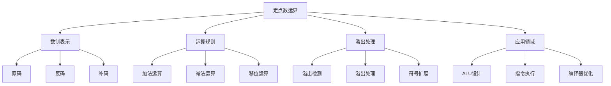

# 定点数运算

## 1. 知识点概述

### 定义和基本概念
定点数是指小数点位置固定的数值表示方法，通常分为定点整数和定点小数。在计算机中，定点数主要采用补码表示法，这是理解计算机算术运算的基础。

### 在考试中的重要性 ⭐⭐⭐⭐
- **基础性强**：是理解浮点数运算的前提
- **考察频率**：每年都有相关题目，特别是补码运算
- **应用广泛**：与ALU设计、指令执行等密切相关

### 与其他知识点的关联
- 为浮点数运算提供基础
- 与ALU设计直接相关
- 影响指令系统的设计
- 关联计算机性能分析

## 2. 理论基础

### 数制表示方法

#### 1. 原码表示
对于n位二进制数，最高位为符号位，其余位表示数值的绝对值。
- 正数：符号位为0，数值位为绝对值的二进制
- 负数：符号位为1，数值位为绝对值的二进制

**表示范围**：`-(2^(n-1)-1) ～ +(2^(n-1)-1)`

#### 2. 反码表示
- 正数：与原码相同
- 负数：符号位为1，数值位为原码数值位的按位取反

#### 3. 补码表示 ⭐⭐⭐⭐⭐
- 正数：与原码相同
- 负数：反码加1

**表示范围**：`-2^(n-1) ～ +(2^(n-1)-1)`

### 补码的重要性质

#### 性质1：唯一性
每个数只有唯一的补码表示，包括零。

#### 性质2：模运算特性
补码运算相当于模 2^n 的运算。

#### 性质3：符号扩展
在扩展位数时，只需要将符号位向左扩展。

### 关键公式

#### 1. 补码转换公式
对于负数x的补码：`[x]补 = 2^n + x`

#### 2. 补码求负公式
`[-x]补 = [x]补的按位取反 + 1`

#### 3. 溢出判断条件
- **正溢出**：两正数相加结果为负
- **负溢出**：两负数相加结果为正
- **符号位判断**：`C_n ⊕ C_(n-1) = 1`时发生溢出

## 3. 重难点分析

### 常见误区和易错点 ⚠️

#### 误区1：原码运算规则应用错误
**错误做法**：直接将原码相加减
**正确理解**：原码不能直接进行加减运算，需要先转换为补码

#### 误区2：补码转换步骤错误
**常见错误**：反码加1时忘记处理进位
**正确步骤**：逐位取反后，从最低位开始加1，处理所有进位

#### 误区3：溢出判断错误
**错误判断**：只看结果的符号位
**正确方法**：检查符号位进位和最高数值位进位的异或结果

### 深入理解要点

#### 1. 为什么使用补码？
- **简化硬件**：加法和减法可以用同一套电路实现
- **消除负零**：只有一个零的表示
- **扩大表示范围**：比原码多表示一个最小负数

#### 2. 溢出的本质
溢出是指运算结果超出了机器数的表示范围，导致结果错误。

#### 3. 移位运算的特殊性
- **算术移位**：保持符号位不变
- **逻辑移位**：符号位也参与移位

### 记忆技巧 💡

#### 1. 补码转换记忆法
"负数补码三步走：原码取反再加一"

#### 2. 溢出判断口诀
"同号相加异号出，符号改变就溢出"

#### 3. 移位运算记忆
"算术移位看符号，逻辑移位全移动"

## 4. 典型例题解析

### 例题1：补码表示与转换 ⭐⭐⭐⭐

**题目描述：**
用8位补码表示十进制数+25和-25，并验证它们相加的结果。

**解题思路：**
1. 将正数转换为补码
2. 将负数转换为补码  
3. 执行补码加法
4. 验证结果正确性

**详细解答：**

**步骤1：+25的补码表示**
25的二进制：11001₂
8位表示：00011001₂
补码：00011001₂（正数补码等于原码）

**步骤2：-25的补码表示**
25的原码：00011001₂
取反：11100110₂
加1：11100111₂
所以[-25]补 = 11100111₂

**步骤3：验证相加**
```
  00011001₂  (+25)
+ 11100111₂  (-25)
-----------
 100000000₂
```
结果为9位，高位溢出，得到8位结果：00000000₂ = 0

**步骤4：验证**
+25 + (-25) = 0，结果正确。

**关键点总结：**
- 正数补码等于原码
- 负数补码：原码取反加1
- 加法运算时进位溢出不影响结果正确性

**相关变式：**
- 不同位数的补码表示
- 最大正数和最小负数的表示
- 符号扩展的处理方法

### 例题2：补码加减法运算 ⭐⭐⭐⭐⭐

**题目描述：**
计算(-15) + (+10)和(+12) - (-8)，用8位补码表示，并判断是否溢出。

**解题思路：**
1. 转换操作数为补码
2. 执行补码运算
3. 检查溢出
4. 转换结果为十进制

**详细解答：**

**计算1：(-15) + (+10)**

转换为补码：
- +10：00001010₂
- -15的原码：00001111₂
- -15取反：11110000₂  
- -15加1：11110001₂

补码相加：
```
  11110001₂  (-15)
+ 00001010₂  (+10)
-----------
  11111011₂
```

溢出检查：
- 符号位进位：C₇ = 0
- 最高数值位进位：C₆ = 0  
- C₇ ⊕ C₆ = 0，无溢出

结果转换：
11111011₂是负数补码，求原值：
- 取反：00000100₂
- 加1：00000101₂ = 5
- 结果：-5

**计算2：(+12) - (-8) = (+12) + (+8)**

转换为补码：
- +12：00001100₂
- +8：00001000₂

补码相加：
```
  00001100₂  (+12)
+ 00001000₂  (+8)
-----------
  00010100₂  (+20)
```

溢出检查：无溢出
结果：+20

**关键点总结：**
- 减法转换为加法：A - B = A + (-B)
- 溢出判断：检查符号位和最高数值位的进位
- 负数结果需要重新转换求值

### 例题3：移位运算分析 ⭐⭐⭐⭐

**题目描述：**
对8位补码11010110₂分别进行算术右移2位和逻辑右移2位，分析结果差异。

**解题思路：**
1. 确定原数值
2. 执行算术右移
3. 执行逻辑右移
4. 分析差异原因

**详细解答：**

**步骤1：确定原数值**
11010110₂是负数补码
- 取反：00101001₂
- 加1：00101010₂ = 42
- 原值：-42

**步骤2：算术右移2位**
算术右移保持符号位：
11010110₂ → 11110101₂

验证结果：
- 取反：00001010₂
- 加1：00001011₂ = 11  
- 结果：-11

理论值：-42 ÷ 4 = -10.5，向负无穷舍入得-11 ✓

**步骤3：逻辑右移2位**
逻辑右移不考虑符号：
11010110₂ → 00110101₂ = 53

**步骤4：差异分析**
- 算术右移：-11（保持负数性质）
- 逻辑右移：+53（改变了符号）

**关键点总结：**
- 算术右移适用于有符号数除法
- 逻辑右移适用于无符号数或位操作
- 负数算术右移需要特殊处理

## 5. 解题方法总结

### 解题思路框架

#### 补码转换题型
```
1. 判断符号 → 确定正负
2. 求绝对值 → 转换为二进制
3. 补码处理 → 正数不变，负数取反加1
4. 位数调整 → 符号扩展到指定位数
5. 结果验证 → 检查转换正确性
```

#### 补码运算题型
```
1. 操作数转换 → 转为补码表示
2. 运算执行 → 按补码规则运算
3. 溢出检查 → 判断是否越界
4. 结果转换 → 补码转为十进制
5. 合理性验证 → 检查结果正确性
```

### 关键步骤提炼

#### 1. 补码转换步骤
- **正数转换**：直接写二进制，高位补0
- **负数转换**：写原码→按位取反→加1
- **位数扩展**：符号位向高位扩展

#### 2. 溢出检查方法
- **方法1**：符号位进位检查法
- **方法2**：结果符号判断法  
- **方法3**：数值范围检查法

#### 3. 移位运算规则
- **算术左移**：低位补0，注意溢出
- **算术右移**：高位补符号位
- **逻辑移位**：统一补0

### 时间分配建议
- 补码转换题：3-5分钟
- 补码运算题：5-8分钟
- 移位运算题：3-5分钟

## 6. 相关真题练习

### 历年真题选编

#### 真题1（2019年）
用8位补码表示-127和+127，说明为什么-128可以表示而+128不能表示。

**解题要点**：
- 8位补码表示范围：-128～+127
- -128的补码：10000000₂
- +128超出表示范围

#### 真题2（2020年）
计算8位补码运算：(01110000)₂ + (10010000)₂，判断是否溢出。

**解题要点**：
- 一正一负相加，不会溢出
- 按补码加法规则计算
- 验证结果正确性

#### 真题3（2021年）
分析为什么补码能够简化计算机的运算电路设计。

**解题要点**：
- 加法和减法统一处理
- 消除符号位特殊处理
- 硬件实现简化

### 模拟题推荐

#### 基础练习
1. 将±64、±100转换为8位补码
2. 计算各种补码加减法运算
3. 练习不同的移位运算

#### 进阶练习
1. 分析不同字长的补码表示范围
2. 设计补码运算的硬件电路
3. 比较不同数制的优缺点

#### 综合应用
1. 分析补码在实际处理器中的应用
2. 设计溢出检测电路
3. 优化补码运算算法

### 自测练习

#### 快速自测题
1. 8位补码能表示的最小负数是多少？
2. 补码的最大优点是什么？
3. 什么情况下会发生溢出？

#### 计算自测题
1. 将-56转换为8位补码
2. 计算(+15) + (-23)的8位补码运算
3. 对10110011₂进行算术右移1位

**答案要点**：
1. 最小负数：-128
2. 简化运算电路，加减法统一
3. 同号数相加结果异号时

## 7. 知识点关联图



### 与其他知识点的关联
- **浮点数运算** ← 定点数基础 → **更高精度**
- **ALU设计** ← 运算规则 → **硬件实现**
- **指令系统** ← 数据表示 → **程序执行**

### 实际应用场景
- **整数运算**：程序中的整数计算
- **地址计算**：内存地址的偏移计算
- **控制逻辑**：程序计数器的更新
- **数字信号处理**：采样数据的运算

---

掌握定点数运算是理解计算机数值计算的基础，为学习更复杂的浮点数运算和ALU设计打下坚实基础。通过深入理解补码的性质和运算规则，您将具备分析计算机算术运算问题的能力！