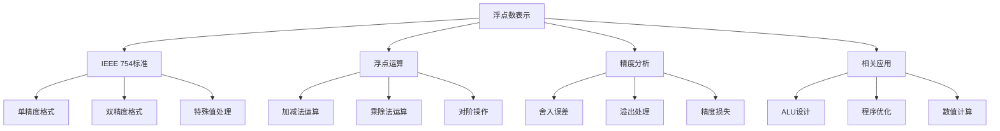

# 浮点数表示与运算

## 1. 知识点概述

### 定义和基本概念
浮点数是计算机中表示实数的一种格式，采用科学计数法的思想，用符号位、指数位和尾数位来表示一个实数。IEEE 754标准是当前广泛采用的浮点数表示标准。

### 在考试中的重要性 ⭐⭐⭐⭐⭐
- **高频考点**：几乎每年必考，是408计算机组成原理的核心知识点
- **分值占比**：通常占数据表示模块60%以上的分值
- **题型多样**：既有理论分析题，也有计算应用题

### 与其他知识点的关联
- 与定点数运算形成对比
- 关联ALU设计和浮点运算器
- 影响程序的精度和性能分析

## 2. 理论基础

### IEEE 754标准格式

#### 单精度浮点数（32位）
```
符号位(S) | 指数位(E) | 尾数位(M)
   1位   |   8位    |  23位
```

#### 双精度浮点数（64位）
```
符号位(S) | 指数位(E) | 尾数位(M)
   1位   |  11位    |  52位
```

### 浮点数的数学表示
**规格化数**：`(-1)^S × (1 + M) × 2^(E-Bias)`

其中：
- S：符号位（0表示正数，1表示负数）
- E：指数的二进制表示
- M：尾数的小数部分
- Bias：偏置值（单精度为127，双精度为1023）

### 关键公式

#### 1. 指数偏置公式
- 单精度：`真实指数 = E - 127`
- 双精度：`真实指数 = E - 1023`

#### 2. 数值范围
- 单精度最小正规格化数：`2^(-126) ≈ 1.18 × 10^(-38)`
- 单精度最大正规格化数：`(2-2^(-23)) × 2^127 ≈ 3.40 × 10^38`

### 特殊值处理

| 指数E | 尾数M | 表示含义 |
|-------|-------|----------|
| 全0 | 全0 | ±0 |
| 全0 | 非0 | 非规格化数 |
| 全1 | 全0 | ±∞ |
| 全1 | 非0 | NaN（非数） |

## 3. 重难点分析

### 常见误区和易错点 ⚠️

#### 误区1：忽略隐含的1
**错误理解**：认为尾数就是M的值
**正确理解**：规格化数的尾数实际上是 `1 + M`，其中1是隐含的

#### 误区2：指数偏置计算错误
**错误做法**：直接使用E的值作为指数
**正确做法**：使用 `E - Bias` 作为真实指数

#### 误区3：特殊值判断错误
**常见错误**：将非规格化数当作规格化数处理
**判断要点**：首先检查指数是否为全0或全1

### 深入理解要点

#### 1. 为什么使用偏置表示？
- 简化比较运算：可以直接比较浮点数的位模式
- 避免负指数：使所有指数都表示为正数
- 提高运算效率：减少符号判断的复杂性

#### 2. 精度损失的原因
- **舍入误差**：有限位数无法精确表示所有实数
- **阶码对齐**：加减运算时的右移操作
- **累积误差**：多次运算后误差累积

### 记忆技巧 💡

#### 1. 偏置值记忆
- 单精度：`2^(8-1) - 1 = 127`
- 双精度：`2^(11-1) - 1 = 1023`
- 规律：`2^(指数位数-1) - 1`

#### 2. 特殊值记忆口诀
- "全0全0是真零"
- "全0非0非规化"  
- "全1全0无穷大"
- "全1非0不是数"

## 4. 典型例题解析

### 例题1：IEEE 754格式转换 ⭐⭐⭐⭐

**题目描述：**
将十进制数 -13.25 转换为IEEE 754单精度浮点数格式。

**解题思路：**
1. 确定符号位
2. 将绝对值转换为二进制
3. 规格化表示
4. 计算偏置指数
5. 确定尾数

**详细解答：**

**步骤1：确定符号位**
-13.25是负数，所以符号位 S = 1

**步骤2：转换为二进制**
13.25 = 13 + 0.25 = 1101₂ + 0.01₂ = 1101.01₂

**步骤3：规格化**
1101.01₂ = 1.10101₂ × 2³

**步骤4：计算指数**
真实指数 = 3
偏置指数 E = 3 + 127 = 130 = 10000010₂

**步骤5：确定尾数**
规格化后小数部分：0.10101
补齐23位：10101000000000000000000₂

**最终结果：**
```
符号位：1
指数：10000010
尾数：10101000000000000000000
完整表示：11000001010101000000000000000000
```

**关键点总结：**
- 符号位判断：负数为1，正数为0
- 规格化：小数点前只能有1位数字1
- 偏置指数：真实指数加上127

**相关变式：**
- 正数转换：+26.75转换为IEEE 754格式
- 特殊值：0、无穷大的表示方法
- 逆向转换：给定IEEE 754格式求十进制值

### 例题2：浮点数加法运算 ⭐⭐⭐⭐⭐

**题目描述：**
计算 1.010₂ × 2² + 1.110₂ × 2⁻¹，并将结果规格化。

**解题思路：**
1. 对阶（使指数相同）
2. 尾数相加
3. 结果规格化
4. 舍入处理

**详细解答：**

**步骤1：对阶操作**
- 第一个数：1.010₂ × 2²
- 第二个数：1.110₂ × 2⁻¹

较大指数为2，需要将第二个数的指数调整为2：
1.110₂ × 2⁻¹ = 0.001110₂ × 2²

**步骤2：尾数相加**
```
  1.010000₂
+ 0.001110₂
-----------
  1.011110₂
```

**步骤3：检查规格化**
结果 1.011110₂ × 2² 已经是规格化形式

**步骤4：最终结果**
1.011110₂ × 2² = 1.484375₁₀

**关键点总结：**
- 对阶原则：小阶向大阶看齐
- 精度保持：右移时保留足够精度位
- 规格化检查：确保小数点前只有一位1

### 例题3：浮点数乘法运算 ⭐⭐⭐⭐

**题目描述：**
计算 (1.101₂ × 2³) × (1.011₂ × 2⁻²)，给出规格化结果。

**解题思路：**
1. 指数相加
2. 尾数相乘
3. 结果规格化
4. 检查溢出

**详细解答：**

**步骤1：指数运算**
指数相加：3 + (-2) = 1

**步骤2：尾数相乘**
```
    1.101₂
×   1.011₂
---------
    1101
   1101
  0000
 1101
---------
10.001111₂
```

**步骤3：规格化**
10.001111₂ × 2¹ = 1.0001111₂ × 2²

**步骤4：最终结果**
1.0001111₂ × 2² ≈ 4.0625₁₀

**关键点总结：**
- 指数运算：相乘时指数相加
- 尾数运算：按二进制乘法规则
- 规格化调整：确保格式正确

## 5. 解题方法总结

### 解题思路框架

#### IEEE 754转换题型
```
1. 判断符号 → 确定符号位
2. 整数转换 → 二进制表示
3. 小数转换 → 二进制小数
4. 规格化 → 调整指数和尾数
5. 偏置处理 → 计算存储指数
6. 格式组装 → 符号+指数+尾数
```

#### 浮点运算题型
```
1. 提取组件 → 符号、指数、尾数
2. 特殊值检查 → 0、无穷、NaN
3. 执行运算 → 按运算类型处理
4. 结果规格化 → 调整到标准格式
5. 溢出检查 → 判断是否越界
6. 舍入处理 → 按舍入规则调整
```

### 关键步骤提炼

#### 1. 对阶操作（加减法）
- 比较两数指数大小
- 小指数向大指数对齐
- 右移尾数，指数增加
- 保留必要的精度位

#### 2. 规格化调整
- 确保小数点前只有一位1
- 左移：指数减小，尾数左移
- 右移：指数增大，尾数右移
- 处理特殊情况

#### 3. 溢出判断
- 上溢：指数超过最大值
- 下溢：指数小于最小值
- 特殊值：无穷大、零的处理

### 时间分配建议
- IEEE 754转换题：5-8分钟
- 浮点运算题：8-12分钟
- 精度分析题：3-5分钟

## 6. 相关真题练习

### 历年真题选编

#### 真题1（2020年）
将十进制数65.25转换为IEEE 754单精度浮点数。

**解题要点**：
- 65 = 1000001₂
- 0.25 = 0.01₂  
- 65.25 = 1000001.01₂ = 1.00000101₂ × 2⁶

#### 真题2（2019年）
已知两个IEEE 754单精度浮点数进行加法运算，分析可能的精度损失。

**解题要点**：
- 对阶时的右移损失
- 尾数位数限制
- 舍入误差分析

#### 真题3（2021年）
判断给定的32位二进制串表示的浮点数类型和数值。

**解题要点**：
- 分离符号位、指数位、尾数位
- 判断是否为特殊值
- 计算实际数值

### 模拟题推荐

#### 基础练习
1. 将 -0.75、3.14159、0.1 转换为IEEE 754格式
2. 解释为什么0.1在计算机中无法精确表示
3. 分析单精度浮点数的表示范围

#### 进阶练习
1. 设计浮点数加法器的基本流程
2. 分析不同舍入方式对计算精度的影响
3. 比较定点数和浮点数在表示范围和精度上的差异

#### 综合应用
1. 编程实现IEEE 754格式转换
2. 分析浮点运算的累积误差
3. 设计测试用例验证浮点运算的正确性

### 自测练习

#### 快速自测题
1. IEEE 754单精度浮点数的偏置值是多少？
2. 什么情况下浮点数表示无穷大？
3. 非规格化数的特点是什么？

#### 计算自测题
1. 将12.375转换为IEEE 754单精度格式
2. 计算1.25 × 2³ + 1.5 × 2¹
3. 判断01000001110100000000000000000000表示的数值

**答案要点**：
1. 偏置值：127
2. 指数全1且尾数全0时
3. 指数为0但尾数不为0，用于表示非常小的数

## 7. 知识点关联图



### 核心概念关联
- **数据表示** ← 浮点数 → **运算器设计**
- **精度控制** ← 浮点数 → **算法设计**
- **标准化** ← IEEE 754 → **系统兼容性**

### 实际应用关联
- **科学计算**：高精度数值计算
- **图形处理**：3D坐标变换
- **信号处理**：数字滤波器设计
- **人工智能**：神经网络权重表示

---

掌握浮点数表示与运算是计算机组成原理的基础，也是理解现代计算机数值计算的关键。通过深入学习IEEE 754标准和相关运算方法，您将具备分析和解决浮点数相关问题的能力！