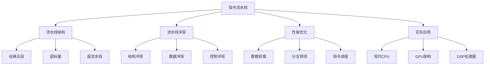

# 指令流水线技术

## 1. 知识点概述

### 定义和基本概念
指令流水线是一种实现指令级并行的技术，将指令的执行过程分解为若干个相互独立的步骤，不同指令的不同步骤可以在不同的功能部件上同时执行，从而提高处理器的吞吐率。

### 在考试中的重要性 ⭐⭐⭐⭐⭐
- **核心考点**：指令系统模块的重点
- **分值占比**：通常占指令系统50%以上分值
- **题型多样**：性能计算、冲突分析、流水线设计
- **综合性强**：涉及指令执行、性能分析等多方面

### 与其他知识点的关联
- 基于指令执行周期
- 关联CPU设计和控制
- 影响系统整体性能
- 与Cache设计相互影响

## 2. 理论基础

### 流水线基本概念

#### 经典五段流水线
1. **IF（取指令）**：从内存读取指令
2. **ID（译码）**：解析指令并读取寄存器
3. **EX（执行）**：执行运算或计算地址
4. **MEM（访存）**：读写内存数据
5. **WB（写回）**：将结果写回寄存器

#### 流水线性能指标

**吞吐率（Throughput）**
```
理想吞吐率 = 1 / 时钟周期
实际吞吐率 = 完成指令数 / 总时间
```

**加速比（Speedup）**
```
理想加速比 = 流水线段数
实际加速比 = 非流水线时间 / 流水线时间
```

**效率（Efficiency）**
```
效率 = 实际加速比 / 理想加速比 × 100%
```

## 3. 流水线冲突 🔥

### 3.1 结构冲突（资源冲突）

#### 产生原因
多条指令同时需要使用同一个硬件资源。

#### 典型例子
- 指令Cache和数据Cache共用同一存储器
- 多条指令同时需要使用ALU
- 寄存器文件的读写端口不足

#### 解决方法
- **资源重复设置**：增加硬件资源
- **资源预约**：建立资源使用时间表
- **指令调度**：重新安排指令顺序

### 3.2 数据冲突（数据相关）

#### RAW冲突（读后写）
后续指令要读取前面指令写入的数据。
```
ADD R1, R2, R3    # R1 = R2 + R3
SUB R4, R1, R5    # R4 = R1 - R5 (需要等待ADD完成)
```

#### WAR冲突（写后读）
后续指令要写入前面指令需要读取的数据。
```
ADD R1, R2, R3    # 需要读取R2
SUB R2, R4, R5    # 要写入R2 (在ADD读取前不能写)
```

#### WAW冲突（写后写）
两条指令要写入同一个寄存器。
```
ADD R1, R2, R3    # 写入R1
SUB R1, R4, R5    # 也要写入R1
```

#### 解决方法
- **数据前推（Forwarding）**：将结果直接传递给需要的指令
- **流水线停顿（Stall）**：让后续指令等待
- **指令重排序**：改变指令执行顺序

### 3.3 控制冲突（分支冲突）

#### 产生原因
分支指令的结果会改变程序执行流程，但分支结果要到EX阶段才能确定。

#### 解决方法

**静态分支预测**
- **总是预测不跳转**：继续取下一条指令
- **总是预测跳转**：取分支目标指令
- **基于操作码预测**：根据分支类型预测

**动态分支预测**
- **一位预测器**：根据上次分支结果预测
- **两位预测器**：使用状态机减少预测错误
- **相关预测器**：考虑分支历史相关性

**延迟槽技术**
在分支指令后插入延迟槽，无论分支是否发生都会执行。

## 4. 典型例题解析

### 例题1：流水线性能计算 ⭐⭐⭐⭐⭐

**题目描述：**
某五段流水线CPU执行100条指令，每段流水线需要1个时钟周期。假设没有任何冲突，计算：
1. 流水线总执行时间
2. 吞吐率
3. 加速比

**解题思路：**
1. 分析流水线执行过程
2. 计算关键性能指标
3. 与非流水线方式比较

**详细解答：**

**无流水线情况：**
```
每条指令需要5个时钟周期
总时间 = 100 × 5 = 500个时钟周期
```

**流水线情况：**
```
第1条指令完成时间：5个时钟周期
后续99条指令每条需要：1个时钟周期
总时间 = 5 + 99 = 104个时钟周期
```

**性能指标计算：**
```
1. 总执行时间：104个时钟周期

2. 吞吐率 = 100条指令 / 104个时钟周期 ≈ 0.96 条指令/周期

3. 加速比 = 500 / 104 ≈ 4.81
   理想加速比 = 5
   效率 = 4.81 / 5 = 96.2%
```

### 例题2：数据冲突处理 ⭐⭐⭐⭐⭐

**题目描述：**
分析以下指令序列的数据冲突，并给出解决方案：
```
1: ADD R1, R2, R3
2: SUB R4, R1, R5  
3: AND R6, R1, R7
4: OR  R8, R6, R9
```

**解题思路：**
1. 识别数据相关关系
2. 分析冲突类型和位置
3. 设计解决方案

**详细解答：**

**冲突分析：**
```
指令1和指令2：RAW冲突（R1）
指令1和指令3：RAW冲突（R1）
指令3和指令4：RAW冲突（R6）
```

**流水线时序图（无处理）：**
```
时钟周期: 1  2  3  4  5  6  7  8  9  10 11 12
指令1:   IF ID EX MEM WB
指令2:      IF ID -- -- EX MEM WB
指令3:         IF -- -- ID EX MEM WB
指令4:            IF -- -- ID -- EX MEM WB
```

**数据前推解决方案：**
```
时钟周期: 1  2  3  4  5  6  7  8  9
指令1:   IF ID EX MEM WB
指令2:      IF ID EX MEM WB     (EX阶段从指令1的MEM阶段前推)
指令3:         IF ID EX MEM WB  (EX阶段从指令1的MEM阶段前推)
指令4:            IF ID EX MEM WB (EX阶段从指令3的MEM阶段前推)
```

**关键点总结：**
- 数据前推可以显著减少流水线停顿
- 需要在硬件中增加前推路径
- 有些情况仍需要插入停顿周期

### 例题3：分支预测分析 ⭐⭐⭐⭐

**题目描述：**
某分支指令的实际执行序列为：T,T,N,T,N,N,T,T
分别用一位预测器和两位预测器分析预测准确率（初始预测为T）。

**解题思路：**
1. 理解预测器工作原理
2. 逐步模拟预测过程
3. 统计预测准确率

**详细解答：**

**一位预测器：**
```
实际序列: T  T  N  T  N  N  T  T
预测结果: T  T  T  N  T  N  N  T
预测对错: ✓  ✓  ✗  ✗  ✗  ✓  ✗  ✓

准确率 = 4/8 = 50%
```

**两位预测器（强预测跳转→弱预测跳转→弱预测不跳转→强预测不跳转）：**
```
初始状态：强预测跳转(ST)

实际:T 预测:T(ST) 结果:✓ 状态保持:ST
实际:T 预测:T(ST) 结果:✓ 状态保持:ST  
实际:N 预测:T(ST) 结果:✗ 状态转移:WT
实际:T 预测:T(WT) 结果:✓ 状态转移:ST
实际:N 预测:T(ST) 结果:✗ 状态转移:WT
实际:N 预测:T(WT) 结果:✗ 状态转移:WN
实际:T 预测:N(WN) 结果:✗ 状态转移:WT
实际:T 预测:T(WT) 结果:✓ 状态转移:ST

准确率 = 5/8 = 62.5%
```

## 5. 解题方法总结

### 流水线性能计算框架
```
1. 确定流水线段数和每段时间
2. 分析指令数量和依赖关系
3. 考虑各种冲突的影响
4. 计算总执行时间
5. 计算性能指标
```

### 冲突分析方法
```
1. 指令相关性分析 → 找出数据依赖
2. 资源使用分析 → 识别结构冲突
3. 控制流分析 → 确定分支影响
4. 时序图绘制 → 可视化冲突
5. 解决方案设计 → 优化性能
```

### 关键公式
```
理想执行时间 = 流水线段数 + 指令数 - 1
实际执行时间 = 理想时间 + 冲突延迟时间
吞吐率 = 指令数 / 总执行时间
加速比 = 非流水线时间 / 流水线时间
```

## 6. 知识点关联图



掌握指令流水线技术是理解现代处理器设计的基础，对于分析和优化计算机系统性能具有重要意义！