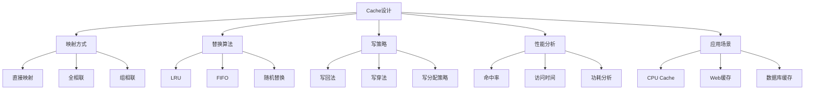

# Cache存储器设计

## 1. 知识点概述

### 定义和基本概念
Cache是位于CPU和主存之间的高速小容量存储器，利用程序的局部性原理，将最近或最频繁访问的数据和指令存储在Cache中，以减少CPU访问主存的次数，显著提高系统性能。

### 在考试中的重要性 ⭐⭐⭐⭐⭐
- **核心考点**：408考试中存储系统模块的重中之重
- **分值占比**：通常占存储系统40-50%的分值
- **题型丰富**：理论分析、性能计算、设计应用等多种题型
- **综合性强**：涉及映射、替换、写策略等多个方面

### 与其他知识点的关联
- 与虚拟存储系统协同工作
- 影响CPU性能和程序执行效率
- 关联总线设计和内存层次结构
- 与编译器优化和程序设计相关

## 2. 理论基础

### Cache基本原理

#### 局部性原理
Cache设计基于程序执行的两个局部性特征：

**时间局部性（Temporal Locality）**
- 最近被访问的数据很可能在近期再次被访问
- 典型例子：循环变量、递归调用

**空间局部性（Spatial Locality）**  
- 如果某个存储位置被访问，其附近的位置很可能也会被访问
- 典型例子：数组遍历、顺序指令执行

#### Cache的层次结构
现代计算机通常采用多级Cache：
- **L1 Cache**：最快，容量最小，与CPU核心最近
- **L2 Cache**：速度中等，容量中等
- **L3 Cache**：速度较慢，容量最大，通常多核共享

### Cache组织结构

#### 基本组成
```
Cache行 = 标记位(Tag) + 数据块(Data Block) + 控制位
```

#### 关键参数
- **Cache容量(C)**：Cache能存储的总字节数
- **块大小(B)**：每个Cache行存储的字节数
- **关联度(E)**：每个组内的Cache行数
- **组数(S)**：Cache分组的数量

#### 关系公式
```
Cache容量 C = S × E × B
总行数 = S × E
地址位数 = 标记位 + 组索引位 + 块内偏移位
```

### 地址划分

对于32位地址系统：
```
|  标记位(t)  |  组索引(s)  |  块内偏移(b)  |
|     t      |     s      |      b       |
```

其中：
- `b = log₂(B)`（块内偏移位数）
- `s = log₂(S)`（组索引位数）  
- `t = 32 - s - b`（标记位数）

## 3. Cache映射方式 🔥

### 3.1 直接映射（Direct Mapped）

#### 映射规则
每个主存块只能映射到Cache中的一个固定位置。
```
Cache行号 = (主存块号) mod (Cache行数)
```

#### 地址结构
```
|    标记位     |    行索引     |   块内偏移   |
|      t       |      s       |      b      |
```

#### 优缺点分析
**优点**：
- 硬件实现简单
- 访问速度快
- 成本低

**缺点**：
- 冲突率高
- Cache利用率可能较低
- 容易产生抖动现象

### 3.2 全相联映射（Fully Associative）

#### 映射规则
主存中的任意块可以映射到Cache中的任意位置。

#### 地址结构
```
|       标记位        |   块内偏移   |
|         t          |      b      |
```

#### 优缺点分析
**优点**：
- 冲突率最低
- Cache利用率最高
- 灵活性强

**缺点**：
- 硬件复杂，成本高
- 访问速度相对较慢
- 需要复杂的替换算法

### 3.3 组相联映射（Set Associative）

#### 映射规则
Cache分为若干组，每组包含多个行。主存块可以映射到指定组内的任意行。

#### 地址结构
```
|    标记位     |    组索引     |   块内偏移   |
|      t       |      s       |      b      |
```

#### 常见类型
- **2路组相联**：每组2行
- **4路组相联**：每组4行
- **8路组相联**：每组8行

#### 优缺点分析
**优点**：
- 平衡了性能和成本
- 冲突率适中
- 实现复杂度可控

**缺点**：
- 比直接映射复杂
- 比全相联性能略低

## 4. 重难点分析

### 常见误区和易错点 ⚠️

#### 误区1：映射方式理解错误
**错误理解**：认为组相联就是简单的分组
**正确理解**：组相联是在组内实现全相联，组间实现直接映射

#### 误区2：地址位数计算错误
**常见错误**：忘记考虑字节地址的影响
**正确方法**：
- 块内偏移 = log₂(块大小/字节)
- 组索引 = log₂(组数)
- 标记位 = 总地址位数 - 组索引位 - 块内偏移位

#### 误区3：命中率计算错误
**错误做法**：只考虑一种访问模式
**正确分析**：需要考虑实际的访问序列和替换策略

### 深入理解要点

#### 1. 为什么需要不同的映射方式？
- **性能需求**：不同应用对性能要求不同
- **成本约束**：硬件成本和复杂度的平衡
- **功耗考虑**：移动设备对功耗敏感

#### 2. 如何选择合适的映射方式？
- **访问模式**：随机访问vs顺序访问
- **程序特征**：循环密集vs分支密集
- **系统约束**：面积、功耗、时延要求

#### 3. Cache性能的影响因素
- **容量大小**：影响命中率
- **关联度**：影响冲突miss
- **块大小**：影响空间局部性利用
- **替换策略**：影响temporal miss

### 记忆技巧 💡

#### 1. 映射方式记忆法
- **直接映射**："一对一，速度快，冲突多"
- **全相联**："任意放，灵活好，成本高"  
- **组相联**："分组管，折中选，最常用"

#### 2. 地址分解记忆
"从右到左：偏移、索引、标记"

#### 3. 性能分析要点
"命中看时间，失效看成本，设计看平衡"

## 5. 典型例题解析

### 例题1：Cache映射分析 ⭐⭐⭐⭐⭐

**题目描述：**
某计算机系统主存容量为1MB，Cache容量为8KB，块大小为64B。分别分析直接映射、2路组相联、全相联三种映射方式下的地址结构。

**解题思路：**
1. 计算基本参数
2. 确定地址位数分配
3. 分析每种映射方式
4. 对比优缺点

**详细解答：**

**步骤1：基本参数计算**
- 主存容量：1MB = 2²⁰字节
- Cache容量：8KB = 2¹³字节  
- 块大小：64B = 2⁶字节
- 地址位数：20位
- Cache总行数：8KB ÷ 64B = 128行

**步骤2：直接映射分析**
```
参数计算：
- Cache行数：128 = 2⁷
- 块内偏移：log₂(64) = 6位
- 行索引：log₂(128) = 7位
- 标记位：20 - 6 - 7 = 7位

地址结构：
| 标记位(7) | 行索引(7) | 块内偏移(6) |
```

**步骤3：2路组相联分析**
```
参数计算：
- 组数：128 ÷ 2 = 64 = 2⁶
- 块内偏移：6位
- 组索引：log₂(64) = 6位
- 标记位：20 - 6 - 6 = 8位

地址结构：
| 标记位(8) | 组索引(6) | 块内偏移(6) |
```

**步骤4：全相联分析**
```
参数计算：
- 只有一个组，包含所有128行
- 块内偏移：6位
- 组索引：0位
- 标记位：20 - 0 - 6 = 14位

地址结构：
|    标记位(14)     | 块内偏移(6) |
```

**关键点总结：**
- 关联度越高，标记位越多，组索引位越少
- 块内偏移位数固定，只与块大小有关
- 不同映射方式的硬件复杂度差异显著

**相关变式：**
- 不同容量比例的分析
- 多级Cache的设计考虑
- 性能和成本的权衡分析

### 例题2：Cache性能计算 ⭐⭐⭐⭐⭐

**题目描述：**
某系统Cache命中时间为1个时钟周期，主存访问时间为100个时钟周期，Cache命中率为95%。计算该系统的平均访问时间，并分析提高命中率到98%时的性能改善。

**解题思路：**
1. 理解平均访问时间公式
2. 计算当前平均访问时间
3. 计算改善后的性能
4. 分析性能提升效果

**详细解答：**

**步骤1：平均访问时间公式**
```
平均访问时间 = 命中时间 + 失效率 × 失效代价
其中：
- 命中时间：Cache访问时间
- 失效率：1 - 命中率
- 失效代价：主存访问时间
```

**步骤2：当前性能计算**
```
给定参数：
- Cache命中时间：1周期
- 主存访问时间：100周期  
- 命中率：95%
- 失效率：5%

平均访问时间 = 1 + 0.05 × 100 = 1 + 5 = 6周期
```

**步骤3：改善后性能计算**
```
改善后参数：
- 命中率：98%
- 失效率：2%

平均访问时间 = 1 + 0.02 × 100 = 1 + 2 = 3周期
```

**步骤4：性能改善分析**
```
性能提升 = 原时间 / 新时间 = 6 / 3 = 2倍
时间减少 = (6 - 3) / 6 = 50%
```

**关键点总结：**
- 命中率的小幅提升可以带来显著的性能改善
- 失效代价越高，命中率的影响越大
- Cache设计需要综合考虑命中率和访问时间

### 例题3：Cache替换算法 ⭐⭐⭐⭐

**题目描述：**
某4路组相联Cache，某组当前状态为[A, B, C, D]，访问序列为E, F, A, G, B，分别用LRU和FIFO算法模拟替换过程。

**解题思路：**
1. 理解LRU算法原理
2. 理解FIFO算法原理
3. 逐步模拟访问过程
4. 比较两种算法的效果

**详细解答：**

**LRU算法模拟：**
LRU（Least Recently Used）：替换最近最少使用的块

```
初始状态：[A, B, C, D]（A最近使用，D最久未用）

访问E：miss，替换D
状态：[E, A, B, C]

访问F：miss，替换C  
状态：[F, E, A, B]

访问A：hit，A移到最前
状态：[A, F, E, B]

访问G：miss，替换B
状态：[G, A, F, E]

访问B：miss，替换E
状态：[B, G, A, F]

结果：命中率 = 1/5 = 20%
```

**FIFO算法模拟：**
FIFO（First In First Out）：替换最先进入的块

```
初始状态：[A, B, C, D]（A最先进入）

访问E：miss，替换A
状态：[B, C, D, E]

访问F：miss，替换B
状态：[C, D, E, F]

访问A：miss，替换C
状态：[D, E, F, A]

访问G：miss，替换D
状态：[E, F, A, G]

访问B：miss，替换E
状态：[F, A, G, B]

结果：命中率 = 0/5 = 0%
```

**关键点总结：**
- LRU算法考虑访问的时间局部性
- FIFO算法实现简单但效果可能较差
- 实际选择需要考虑硬件复杂度和性能需求

## 6. Cache写策略 🔥

### 6.1 写命中策略

#### 写回法（Write-Back）
- **原理**：只更新Cache，不立即更新主存
- **标记**：使用脏位(Dirty Bit)标记被修改的块
- **写回时机**：块被替换时才写回主存

#### 写穿法（Write-Through）
- **原理**：同时更新Cache和主存
- **特点**：保持Cache和主存的一致性
- **缺点**：增加了主存写访问次数

### 6.2 写失效策略

#### 写分配（Write-Allocate）
- **原理**：写失效时，先从主存读取块到Cache，再执行写操作
- **适用**：通常与写回法配合使用

#### 写不分配（Write-Not-Allocate）
- **原理**：写失效时，直接写主存，不读取到Cache
- **适用**：通常与写穿法配合使用

### 策略组合分析

| 写命中策略 | 写失效策略 | 优点 | 缺点 | 适用场景 |
|----------|----------|------|------|----------|
| 写回 + 写分配 | 减少主存访问 | 需要脏位管理 | 写密集应用 |
| 写穿 + 写不分配 | 实现简单 | 主存访问多 | 读密集应用 |

## 7. 解题方法总结

### 解题思路框架

#### Cache设计分析题
```
1. 参数提取 → 容量、块大小、关联度
2. 地址分解 → 标记位、索引位、偏移位
3. 映射分析 → 确定映射方式和规则
4. 性能计算 → 命中率、访问时间
5. 优化建议 → 改进方案
```

#### Cache性能计算题
```
1. 确定参数 → 命中时间、失效代价、命中率
2. 应用公式 → 平均访问时间计算
3. 敏感性分析 → 参数变化的影响
4. 对比分析 → 不同方案比较
5. 结论总结 → 最优选择
```

### 关键计算公式

#### 1. 地址位数分配
```
块内偏移位 = log₂(块大小)
组索引位 = log₂(组数)
标记位 = 总地址位 - 组索引位 - 偏移位
```

#### 2. 性能指标
```
平均访问时间 = 命中时间 + 失效率 × 失效代价
加速比 = 无Cache时间 / 有Cache时间
效率 = 命中率 × 100%
```

#### 3. 容量计算
```
Cache容量 = 组数 × 每组行数 × 块大小
开销 = (标记位 + 控制位) × 总行数 / 8
有效容量 = 总容量 - 开销
```

### 时间分配建议
- Cache设计题：8-12分钟
- 性能计算题：5-8分钟
- 算法模拟题：8-10分钟

## 8. 相关真题练习

### 历年真题选编

#### 真题1（2020年）
某计算机Cache采用2路组相联映射，Cache容量为32KB，块大小为64B，主存地址32位。求Cache的组数、每组行数，并画出地址格式。

**解题要点**：
- 总行数 = 32KB ÷ 64B = 512行
- 组数 = 512 ÷ 2 = 256组
- 地址格式：标记位(21) + 组索引(8) + 偏移(6)

#### 真题2（2019年）
分析LRU和FIFO替换算法在相同访问序列下的命中率差异。

**解题要点**：
- 逐步模拟替换过程
- 统计命中和失效次数
- 分析算法特点和适用场景

#### 真题3（2021年）
某系统L1 Cache命中率95%，L2 Cache命中率85%，分析两级Cache的整体性能。

**解题要点**：
- 计算全局命中率
- 分析访问时间组成
- 评估多级Cache效果

### 模拟题推荐

#### 基础练习
1. 不同映射方式的地址格式分析
2. 简单的命中率计算
3. 基本替换算法模拟

#### 进阶练习
1. 多级Cache系统设计
2. 写策略对性能的影响
3. Cache一致性问题分析

#### 综合应用
1. 针对特定应用的Cache优化
2. Cache与虚拟存储的协同
3. 多核系统的Cache设计

### 自测练习

#### 快速自测题
1. 组相联映射的主要优势是什么？
2. 写回法相比写穿法的主要优点？
3. LRU算法的基本思想是什么？

#### 计算自测题
1. 计算16KB 4路组相联Cache的组数
2. 模拟一个简单的LRU替换过程
3. 分析给定参数下的平均访问时间

**答案要点**：
1. 平衡性能和成本，减少冲突失效
2. 减少主存访问次数，提高写性能
3. 替换最近最少使用的数据块

## 9. 知识点关联图



### 核心概念关联
- **局部性原理** ← Cache设计 → **性能优化**
- **存储层次** ← Cache → **虚拟存储**
- **硬件设计** ← 映射方式 → **成本控制**

### 实际应用关联
- **处理器设计**：多级Cache层次
- **编译器优化**：Cache友好的代码生成
- **数据库系统**：缓冲池管理
- **Web系统**：页面缓存策略

---

掌握Cache设计原理是理解现代计算机存储系统的关键。通过深入学习映射方式、替换算法和写策略，您将具备分析和设计高效存储系统的能力！