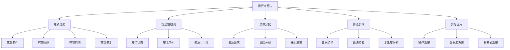

# 银行家算法与死锁避免

## 1. 知识点概述

### 定义和基本概念
银行家算法是由Dijkstra提出的一种死锁避免算法，模拟银行家向客户放贷的过程。系统在分配资源前，先判断分配后系统是否处于安全状态，只有在安全状态下才进行实际分配，从而避免死锁的发生。

### 在考试中的重要性 ⭐⭐⭐⭐⭐
- **必考算法**：408考试中死锁模块的核心考点
- **分值占比**：通常占死锁问题80%以上的分值
- **题型特点**：算法模拟、安全性检测、资源分配判断
- **实用性强**：在实际系统设计中有重要应用

### 与其他知识点的关联
- 基于死锁产生的四个必要条件
- 与资源分配图相互补充
- 关联进程同步与互斥机制
- 影响系统的资源利用率

## 2. 理论基础

### 死锁产生的必要条件

理解银行家算法前，必须深刻理解死锁产生的四个必要条件：

#### 1. 互斥条件（Mutual Exclusion）
一次只有一个进程可以使用一个资源实例。

#### 2. 占有和等待条件（Hold and Wait）
一个进程至少占有一个资源，并等待获取其他进程占有的资源。

#### 3. 不可抢占条件（No Preemption）
资源不能被抢占，只能由占有它的进程自愿释放。

#### 4. 循环等待条件（Circular Wait）
存在一组等待进程 {P₀, P₁, ..., Pₙ}，其中P₀等待P₁占有的资源，P₁等待P₂占有的资源，...，Pₙ等待P₀占有的资源。

### 安全状态的概念

#### 安全状态定义
如果系统能按某种顺序为每个进程分配其所需资源（不超过系统拥有的资源总数）直到满足每个进程的最大需求，使每个进程都能顺利完成，则称该状态是安全的。

#### 安全序列
若存在一个进程序列 {P₁, P₂, ..., Pₙ}，对于每个Pᵢ，它以后尚需的资源量不超过系统当前剩余资源量与所有Pⱼ(j < i)当前占有资源量之和，则称此序列为安全序列。

#### 关键定理
- **安全状态** ⟹ **无死锁**
- **不安全状态** ⟹ **可能发生死锁**
- **死锁状态** ⟹ **不安全状态**

## 3. 银行家算法详解 🔥

### 3.1 数据结构

银行家算法需要维护以下数据结构：

#### 基本向量和矩阵
- **Available[j]**: 系统中j类资源的可用实例数
- **Max[i,j]**: 进程Pᵢ对j类资源的最大需求量
- **Allocation[i,j]**: 进程Pᵢ当前占有的j类资源实例数
- **Need[i,j]**: 进程Pᵢ还需要的j类资源实例数

#### 关系公式
```
Need[i,j] = Max[i,j] - Allocation[i,j]
```

### 3.2 安全性检测算法

#### 算法步骤
```
1. 初始化工作向量
   Work = Available
   Finish[i] = false (for all i)

2. 查找满足条件的进程
   找到一个i使得：
   - Finish[i] == false
   - Need[i] ≤ Work
   
3. 模拟进程执行完成
   Work = Work + Allocation[i]
   Finish[i] = true
   
4. 重复步骤2-3
   直到找到所有进程或无法找到满足条件的进程
   
5. 判断结果
   若所有Finish[i] == true，则系统处于安全状态
   否则系统处于不安全状态
```

#### 算法复杂度
- **时间复杂度**: O(m × n²)，其中m是资源类型数，n是进程数
- **空间复杂度**: O(m × n)

### 3.3 资源分配算法

当进程Pᵢ请求资源Request[i]时：

#### 步骤1：合法性检查
```
if (Request[i] ≤ Need[i]) {
    if (Request[i] ≤ Available) {
        // 进入步骤2
    } else {
        // 等待，因为没有足够的可用资源
    }
} else {
    // 错误，请求超过了声明的最大需求
}
```

#### 步骤2：试探性分配
```
Available = Available - Request[i]
Allocation[i] = Allocation[i] + Request[i]
Need[i] = Need[i] - Request[i]
```

#### 步骤3：安全性检测
运行安全性检测算法，若系统仍处于安全状态，则正式分配；否则恢复到原来状态，进程等待。

## 4. 重难点分析

### 常见误区和易错点 ⚠️

#### 误区1：安全序列理解错误
**错误理解**：认为安全序列是唯一的
**正确理解**：一个安全状态可能有多个安全序列

#### 误区2：Need矩阵计算错误
**常见错误**：Need = Allocation - Max
**正确公式**：Need = Max - Allocation

#### 误区3：安全性检测步骤错误
**错误做法**：
- 没有正确更新Work向量
- 忘记标记Finish数组
- 检测顺序混乱

#### 误区4：资源分配判断错误
**错误判断**：只检查Available是否足够
**正确方法**：必须进行完整的安全性检测

### 深入理解要点

#### 1. 为什么银行家算法是保守的？
- 要求进程事先声明最大需求
- 系统资源总量必须固定
- 进程数量必须固定
- 不允许进程中途释放资源

#### 2. 银行家算法的局限性
- **预先声明**：难以准确预测最大需求
- **资源利用率低**：为了保证安全性，牺牲了效率
- **实现复杂**：需要复杂的数据结构和算法
- **适用性有限**：主要适用于资源数量固定的系统

#### 3. 实际应用的改进
- **动态银行家算法**：允许进程动态申请和释放资源
- **层次化银行家算法**：多级资源管理
- **概率银行家算法**：基于概率的安全性评估

### 记忆技巧 💡

#### 1. 数据结构记忆
"最大需求Max，当前分配Allocation，还需Need，可用Available"

#### 2. 算法步骤记忆
"Work置Available，找Need小于Work，模拟执行完，Work加分配量"

#### 3. 安全检测记忆口诀
"初始化工作向量，循环查找可完成，模拟回收更新量，全部完成即安全"

## 5. 典型例题解析

### 例题1：基本银行家算法应用 ⭐⭐⭐⭐⭐

**题目描述：**
某系统有5个进程P₀-P₄和3种资源A、B、C，在某一时刻的资源分配情况如下：
- 系统资源总量：A=10, B=5, C=7
- 当前分配和最大需求如下表：

| 进程 | Allocation | Max | Need |
|------|------------|-----|------|
|      | A B C | A B C | A B C |
| P₀ | 0 1 0 | 7 5 3 | 7 4 3 |
| P₁ | 2 0 0 | 3 2 2 | 1 2 2 |
| P₂ | 3 0 2 | 9 0 2 | 6 0 0 |
| P₃ | 2 1 1 | 2 2 2 | 0 1 1 |
| P₄ | 0 0 2 | 4 3 3 | 4 3 1 |

求：(1) 当前Available向量 (2) 判断系统是否安全 (3) 若P₁请求(1,0,2)，是否能分配？

**解题思路：**
1. 计算当前可用资源
2. 执行安全性检测算法
3. 模拟资源分配请求

**详细解答：**

**步骤1：计算Available向量**
```
系统总量：A=10, B=5, C=7
已分配总量：
A: 0+2+3+2+0 = 7
B: 1+0+0+1+0 = 2
C: 0+0+2+1+2 = 5

Available = (10-7, 5-2, 7-5) = (3, 3, 2)
```

**步骤2：安全性检测**
```
初始化：
Work = (3, 3, 2)
Finish = [false, false, false, false, false]

第1轮查找：
P₀: Need(7,4,3) > Work(3,3,2) ❌
P₁: Need(1,2,2) ≤ Work(3,3,2) ✅
选择P₁，模拟执行：
Work = (3,3,2) + (2,0,0) = (5,3,2)
Finish[1] = true

第2轮查找：
P₀: Need(7,4,3) > Work(5,3,2) ❌
P₂: Need(6,0,0) > Work(5,3,2) ❌
P₃: Need(0,1,1) ≤ Work(5,3,2) ✅
选择P₃，模拟执行：
Work = (5,3,2) + (2,1,1) = (7,4,3)
Finish[3] = true

第3轮查找：
P₀: Need(7,4,3) ≤ Work(7,4,3) ✅
选择P₀，模拟执行：
Work = (7,4,3) + (0,1,0) = (7,5,3)
Finish[0] = true

第4轮查找：
P₂: Need(6,0,0) ≤ Work(7,5,3) ✅
选择P₂，模拟执行：
Work = (7,5,3) + (3,0,2) = (10,5,5)
Finish[2] = true

第5轮查找：
P₄: Need(4,3,1) ≤ Work(10,5,5) ✅
选择P₄，模拟执行：
Work = (10,5,5) + (0,0,2) = (10,5,7)
Finish[4] = true

所有Finish[i] = true，系统处于安全状态
安全序列：P₁ → P₃ → P₀ → P₂ → P₄
```

**步骤3：处理P₁的请求(1,0,2)**
```
合法性检查：
Request₁(1,0,2) ≤ Need₁(1,2,2) ✅
Request₁(1,0,2) ≤ Available(3,3,2) ✅

试探性分配：
Available = (3,3,2) - (1,0,2) = (2,3,0)
Allocation₁ = (2,0,0) + (1,0,2) = (3,0,2)
Need₁ = (1,2,2) - (1,0,2) = (0,2,0)

安全性检测：
Work = (2,3,0)
P₁: Need(0,2,0) ≤ Work(2,3,0) ✅
P₃: Need(0,1,1) > Work(2,3,0) ❌
P₀: Need(7,4,3) > Work(2,3,0) ❌
P₂: Need(6,0,0) > Work(2,3,0) ❌
P₄: Need(4,3,1) > Work(2,3,0) ❌

只有P₁能完成，其他进程无法找到安全序列
系统进入不安全状态，拒绝分配
```

**关键点总结：**
- 安全性检测必须找到完整的安全序列
- 资源分配请求必须通过完整的银行家算法检验
- 不安全状态不等于死锁，但有死锁风险

### 例题2：多种资源的复杂情况 ⭐⭐⭐⭐⭐

**题目描述：**
某系统有4个进程和4种资源，资源总量为(4,2,1,3)，当前状态如下：

| 进程 | Allocation | Max |
|------|------------|-----|
|      | A B C D | A B C D |
| P₀ | 1 0 0 1 | 3 1 0 2 |
| P₁ | 0 1 0 1 | 0 1 0 1 |
| P₂ | 1 0 0 0 | 2 1 0 2 |
| P₃ | 1 1 0 0 | 1 1 1 0 |

分析系统安全性，并处理以下请求序列：
1. P₀请求(1,0,0,0)
2. P₂请求(0,1,0,1)
3. P₃请求(0,0,1,0)

**解题思路：**
1. 计算初始状态的Need和Available
2. 检测初始安全性
3. 逐一处理资源请求

**详细解答：**

**初始状态分析：**
```
Need矩阵计算：
P₀: (3,1,0,2) - (1,0,0,1) = (2,1,0,1)
P₁: (0,1,0,1) - (0,1,0,1) = (0,0,0,0)
P₂: (2,1,0,2) - (1,0,0,0) = (1,1,0,2)
P₃: (1,1,1,0) - (1,1,0,0) = (0,0,1,0)

Available计算：
总量：(4,2,1,3)
已分配：(3,2,0,2)
Available = (1,0,1,1)

初始安全性检测：
Work = (1,0,1,1)

第1轮：P₁的Need(0,0,0,0) ≤ Work(1,0,1,1) ✅
Work = (1,0,1,1) + (0,1,0,1) = (1,1,1,2)

第2轮：P₃的Need(0,0,1,0) ≤ Work(1,1,1,2) ✅
Work = (1,1,1,2) + (1,1,0,0) = (2,2,1,2)

第3轮：P₂的Need(1,1,0,2) ≤ Work(2,2,1,2) ✅
Work = (2,2,1,2) + (1,0,0,0) = (3,2,1,2)

第4轮：P₀的Need(2,1,0,1) ≤ Work(3,2,1,2) ✅
Work = (3,2,1,2) + (1,0,0,1) = (4,2,1,3)

安全序列：P₁ → P₃ → P₂ → P₀
初始状态安全
```

**处理请求序列：**

**请求1：P₀请求(1,0,0,0)**
```
检查：Request₀(1,0,0,0) ≤ Need₀(2,1,0,1) ✅
检查：Request₀(1,0,0,0) ≤ Available(1,0,1,1) ✅

试探分配：
Available = (1,0,1,1) - (1,0,0,0) = (0,0,1,1)
Allocation₀ = (1,0,0,1) + (1,0,0,0) = (2,0,0,1)
Need₀ = (2,1,0,1) - (1,0,0,0) = (1,1,0,1)

安全性检测：
Work = (0,0,1,1)
只有P₁的Need(0,0,0,0)满足条件
其他进程无法完成，进入不安全状态
拒绝请求
```

**请求2：P₂请求(0,1,0,1)（在初始状态基础上）**
```
检查：Request₂(0,1,0,1) ≤ Need₂(1,1,0,2) ✅
检查：Request₂(0,1,0,1) > Available(1,0,1,1) ❌

资源不足，进程等待
```

**关键点总结：**
- 即使通过合法性检查，也必须进行安全性检测
- 资源不足时直接等待，无需安全性检测
- 复杂系统需要仔细计算每一步

### 例题3：安全序列的多样性 ⭐⭐⭐⭐

**题目描述：**
给定系统状态，找出所有可能的安全序列，并分析不同序列的特点。

| 进程 | Allocation | Max | Need |
|------|------------|-----|------|
|      | A B | A B | A B |
| P₀ | 1 0 | 3 3 | 2 3 |
| P₁ | 0 1 | 1 2 | 1 1 |
| P₂ | 1 1 | 3 3 | 2 2 |

Available = (2, 1)

**解题思路：**
1. 系统化搜索所有可能的执行顺序
2. 验证每种顺序的安全性
3. 分析不同序列的优劣

**详细解答：**

**寻找所有安全序列：**
```
初始：Work = (2,1)

序列1：P₁ → P₀ → P₂
P₁: Need(1,1) ≤ Work(2,1) ✅, Work = (2,1) + (0,1) = (2,2)
P₀: Need(2,3) > Work(2,2) ❌

序列2：P₁ → P₂ → P₀
P₁: Need(1,1) ≤ Work(2,1) ✅, Work = (2,1) + (0,1) = (2,2)
P₂: Need(2,2) ≤ Work(2,2) ✅, Work = (2,2) + (1,1) = (3,3)
P₀: Need(2,3) ≤ Work(3,3) ✅, Work = (3,3) + (1,0) = (4,3)

序列3：P₂ → P₁ → P₀
P₂: Need(2,2) > Work(2,1) ❌

因此，唯一的安全序列是：P₁ → P₂ → P₀
```

**分析：**
- 该系统只有一个安全序列
- P₁必须首先执行（资源需求最少）
- P₀必须最后执行（资源需求最多）

## 6. 解题方法总结

### 解题思路框架

#### 银行家算法题型
```
1. 数据整理 → 提取Allocation、Max，计算Need、Available
2. 初始检测 → 判断当前状态是否安全
3. 请求处理 → 按银行家算法处理资源请求
4. 结果分析 → 给出分配建议和安全序列
```

#### 安全性检测步骤
```
1. 初始化 → Work = Available, Finish[i] = false
2. 循环查找 → 找Need[i] ≤ Work且Finish[i] = false的进程
3. 模拟执行 → Work += Allocation[i], Finish[i] = true
4. 重复步骤2-3 → 直到无法找到满足条件的进程
5. 判断结果 → 所有Finish[i] = true则安全
```

### 关键计算要点

#### 1. 矩阵计算规则
```
Need[i,j] = Max[i,j] - Allocation[i,j]
Available[j] = Total[j] - Σ Allocation[i,j]
```

#### 2. 安全性检测核心
```
for each round:
    find i: Need[i] ≤ Work and Finish[i] = false
    if found:
        Work = Work + Allocation[i]
        Finish[i] = true
    else:
        break
```

#### 3. 资源分配判断
```
if Request[i] ≤ Need[i] and Request[i] ≤ Available:
    // 试探性分配
    // 安全性检测
    // 根据结果决定是否分配
```

### 时间分配建议
- 基本银行家算法：10-15分钟
- 复杂多请求处理：15-20分钟
- 安全序列分析：5-8分钟

## 7. 相关真题练习

### 历年真题选编

#### 真题1（2020年）
某系统采用银行家算法避免死锁，给定当前资源分配状态，判断系统安全性并处理新的资源申请。

**解题要点**：
- 严格按照银行家算法步骤
- 注意Need矩阵的正确计算
- 完整执行安全性检测

#### 真题2（2019年）
分析银行家算法为什么能够避免死锁，以及该算法的局限性。

**解题要点**：
- 理解安全状态与死锁的关系
- 分析算法的保守性
- 讨论实际应用的限制

#### 真题3（2021年）
设计一个改进的银行家算法，能够处理资源总量动态变化的情况。

**解题要点**：
- 分析传统算法的限制
- 提出合理的改进方案
- 验证改进算法的正确性

### 模拟题推荐

#### 基础练习
1. 简单的3进程3资源银行家算法
2. 安全序列的查找和验证
3. 单个资源请求的处理

#### 进阶练习
1. 复杂的多进程多资源系统
2. 连续多个资源请求的处理
3. 动态系统状态的分析

#### 综合应用
1. 银行家算法的优化改进
2. 与其他死锁处理方法的比较
3. 实际系统中的应用案例

### 自测练习

#### 快速自测题
1. 银行家算法的核心思想是什么？
2. 安全状态和无死锁状态是什么关系？
3. Need矩阵如何计算？

#### 计算自测题
1. 给定简单系统状态，执行安全性检测
2. 处理一个资源分配请求
3. 找出给定状态的所有安全序列

**答案要点**：
1. 确保系统始终处于安全状态，避免死锁
2. 安全状态一定无死锁，但无死锁不一定是安全状态
3. Need = Max - Allocation

## 8. 知识点关联图



### 核心概念关联
- **死锁预防** ← 银行家算法 → **死锁避免**
- **资源管理** ← 安全性检测 → **系统稳定性**
- **算法设计** ← 银行家算法 → **系统实现**

### 实际应用关联
- **操作系统**：进程资源分配
- **数据库系统**：锁管理
- **分布式系统**：资源协调
- **云计算**：虚拟资源分配

---

掌握银行家算法是理解死锁避免的关键。通过深入学习算法原理、实现步骤和应用场景，您将具备分析和设计安全资源分配系统的能力！