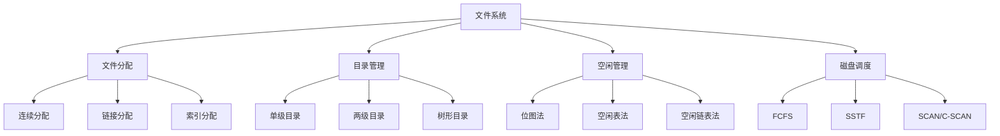

# 文件系统设计

## 1. 知识点概述

### 定义和基本概念
文件系统是操作系统中负责管理和存储文件信息的软件机构，它决定了文件如何存储、组织、访问和管理。文件系统为用户和程序提供了一个逻辑的、统一的文件访问接口，隐藏了底层存储设备的物理细节。

### 在考试中的重要性 ⭐⭐⭐⭐
- **重要考点**：操作系统文件管理模块的核心内容
- **分值占比**：通常占文件系统模块60-70%的分值
- **题型多样**：文件分配分析、磁盘调度计算、目录结构设计
- **实用性强**：与实际系统设计密切相关

### 与其他知识点的关联
- 基于存储设备管理
- 与内存管理协同工作
- 关联I/O管理和设备驱动
- 影响系统整体性能

## 2. 理论基础

### 文件系统基本概念

#### 文件的逻辑结构
- **流式文件**：字节序列，无固定结构
- **记录式文件**：由记录组成，记录可定长或变长
- **索引式文件**：带有索引的记录文件

#### 文件的物理结构
- **顺序结构**：文件在存储设备上连续存放
- **链接结构**：文件块通过指针链接
- **索引结构**：通过索引表管理文件块

#### 文件控制块（FCB）
文件控制块包含文件的所有管理信息：
- **基本信息**：文件名、类型、大小
- **存取控制信息**：访问权限、用户标识
- **使用信息**：创建时间、修改时间、访问时间
- **物理位置信息**：文件在存储设备上的位置

## 3. 文件分配方式 🔥

### 3.1 连续分配

#### 分配原理
为每个文件分配一组连续的存储块，文件占用的磁盘空间是连续的。

#### 实现方法
- 文件控制块记录：起始块号、文件长度
- 地址计算：第i个逻辑块 = 起始块号 + i

#### 优缺点分析
**优点**：
- 访问速度快，支持顺序和随机访问
- 寻道时间最少，磁盘传输效率高
- 实现简单，地址转换直接

**缺点**：
- 产生外部碎片，磁盘利用率低
- 文件大小难以动态增长
- 需要预先知道文件的最大长度

#### 适用场景
- 文件大小相对固定
- 主要进行顺序访问
- 对访问速度要求较高

### 3.2 链接分配

#### 隐式链接分配

**实现原理**：
每个文件块包含指向下一个块的指针，形成链式结构。

**存储结构**：
```
文件块结构：[数据区域 | 下一块指针]
FCB记录：首块指针、尾块指针、文件长度
```

**优缺点分析**：
- **优点**：无外部碎片，文件大小可动态增长
- **缺点**：只支持顺序访问，可靠性差，指针开销大

#### 显式链接分配（FAT）

**实现原理**：
将所有指针信息集中存放在文件分配表（FAT）中。

**FAT表结构**：
```
FAT[块号] = 下一块号 | EOF | FREE
例如：FAT[100] = 150 表示块100的下一块是150
```

**优缺点分析**：
- **优点**：支持随机访问，无指针开销，可靠性好
- **缺点**：FAT表占用内存空间，访问需要查表

### 3.3 索引分配

#### 单级索引

**实现原理**：
为每个文件建立一个索引块，索引块中存放文件各数据块的地址。

**存储结构**：
```
索引块：[块地址0 | 块地址1 | ... | 块地址n]
FCB记录：索引块地址、文件长度
```

**地址转换**：
```
逻辑块号i → 索引块[i] → 物理块地址
```

#### 多级索引

**两级索引结构**：
```
一级索引块 → 二级索引块 → 数据块
```

**三级索引结构**：
```
一级索引块 → 二级索引块 → 三级索引块 → 数据块
```

#### 混合索引（UNIX i-node）

**结构设计**：
```
i-node结构：
- 直接地址指针：10个（直接指向数据块）
- 一次间接指针：1个（指向一级索引块）
- 二次间接指针：1个（指向二级索引块）
- 三次间接指针：1个（指向三级索引块）
```

**寻址能力分析**：
```
假设块大小4KB，指针大小4B：
- 直接块：10 × 4KB = 40KB
- 一次间接：1024 × 4KB = 4MB
- 二次间接：1024² × 4KB = 4GB
- 三次间接：1024³ × 4KB = 4TB
总容量：约4TB
```

#### 优缺点分析
**优点**：
- 支持随机访问
- 无外部碎片
- 文件大小可动态增长
- 索引集中，便于管理

**缺点**：
- 索引块占用额外空间
- 小文件的空间利用率低
- 访问需要多次磁盘I/O

## 4. 磁盘调度算法 🔥

### 4.1 先来先服务（FCFS）

#### 算法原理
按照磁盘访问请求到达的先后顺序进行服务。

#### 算法特点
- **优点**：公平、简单、无饥饿现象
- **缺点**：寻道时间可能很长，效率低

### 4.2 最短寻道时间优先（SSTF）

#### 算法原理
选择距离当前磁头位置最近的请求进行服务。

#### 算法特点
- **优点**：寻道时间短，吞吐量高
- **缺点**：可能产生饥饿现象，不够公平

### 4.3 扫描算法（SCAN）

#### 算法原理
磁头在一个方向上移动，访问沿途的所有请求，到达边界后反向移动。

#### 算法特点
- **优点**：避免饥饿，寻道时间适中
- **缺点**：对刚访问过的区域响应时间长

### 4.4 循环扫描算法（C-SCAN）

#### 算法原理
磁头单向移动，访问沿途请求，到达边界后直接返回起点继续单向扫描。

#### 算法特点
- **优点**：提供更均匀的等待时间
- **缺点**：返回行程没有服务任何请求

### 4.5 LOOK和C-LOOK算法

#### LOOK算法
在SCAN基础上改进，磁头只移动到最远的请求位置，不必到达磁盘边界。

#### C-LOOK算法
在C-SCAN基础上改进，磁头只返回到最小的请求位置。

## 5. 典型例题解析

### 例题1：文件分配方式比较 ⭐⭐⭐⭐⭐

**题目描述：**
某文件系统中有一个5000字节的文件，磁盘块大小为1000字节，指针大小为4字节。比较连续分配、链接分配和索引分配的存储开销和访问效率。

**解题思路：**
1. 计算文件所需的数据块数
2. 分析各种分配方式的存储开销
3. 比较访问效率
4. 总结各自优缺点

**详细解答：**

**基本参数：**
```
文件大小：5000字节
块大小：1000字节
所需数据块：⌈5000/1000⌉ = 5块
指针大小：4字节
```

**连续分配分析：**
```
存储开销：
- 数据块：5块
- FCB记录：起始块号 + 长度 = 8字节
- 总开销：5000字节（数据）+ 8字节（管理）

访问效率：
- 随机访问：O(1)
- 顺序访问：最优
- 寻道次数：1次（连续）
```

**链接分配分析：**
```
隐式链接：
- 每块可用空间：1000 - 4 = 996字节
- 实际需要块数：⌈5000/996⌉ = 6块
- 总开销：6000字节（含指针）+ FCB

显式链接（FAT）：
- 数据块：5块（1000字节/块）
- FAT表项：5个指针 = 20字节
- 总开销：5000字节（数据）+ 20字节（FAT）

访问效率：
- 隐式：只能顺序访问，O(n)
- 显式：支持随机访问，O(1)
```

**索引分配分析：**
```
单级索引：
- 数据块：5块
- 索引块：1块（可存储250个指针）
- 总开销：6000字节（5块数据+1块索引）

访问效率：
- 随机访问：O(1)
- 需要额外的索引块访问
```

**综合比较表：**
| 分配方式 | 存储开销 | 随机访问 | 顺序访问 | 动态增长 |
|---------|---------|---------|---------|---------|
| 连续分配 | 最小 | 最快 | 最快 | 困难 |
| 隐式链接 | 较大 | 不支持 | 较慢 | 容易 |
| 显式链接 | 中等 | 较快 | 较快 | 容易 |
| 索引分配 | 较大 | 快 | 快 | 容易 |

### 例题2：磁盘调度算法模拟 ⭐⭐⭐⭐⭐

**题目描述：**
磁盘有200个磁道（0-199），磁头当前在100号磁道，磁头移动方向向磁道号增加的方向。请求队列为：55, 58, 39, 18, 90, 160, 150, 38, 184。分别用FCFS、SSTF、SCAN、C-SCAN算法计算总寻道距离。

**解题思路：**
1. 理解各算法的调度原理
2. 逐步模拟调度过程
3. 计算总寻道距离
4. 比较算法性能

**详细解答：**

**FCFS算法：**
```
服务顺序：100 → 55 → 58 → 39 → 18 → 90 → 160 → 150 → 38 → 184
寻道距离：|100-55| + |55-58| + |58-39| + |39-18| + |18-90| + |90-160| + |160-150| + |150-38| + |38-184|
        = 45 + 3 + 19 + 21 + 72 + 70 + 10 + 112 + 146
        = 498
```

**SSTF算法：**
```
当前位置100，选择最近的请求：
100 → 90(距离10) → 55(距离35) → 58(距离3) → 39(距离19) → 38(距离1) → 18(距离20) → 150(距离132) → 160(距离10) → 184(距离24)

总寻道距离：10 + 35 + 3 + 19 + 1 + 20 + 132 + 10 + 24 = 254
```

**SCAN算法：**
```
从100开始向右扫描：
100 → 150(50) → 160(10) → 184(24) → 199(15) → 90(109) → 58(32) → 55(3) → 39(16) → 38(1) → 18(20)

总寻道距离：50 + 10 + 24 + 15 + 109 + 32 + 3 + 16 + 1 + 20 = 280
```

**C-SCAN算法：**
```
从100开始向右扫描到199，然后跳转到0：
100 → 150(50) → 160(10) → 184(24) → 199(15) → 0(199) → 18(18) → 38(20) → 39(1) → 55(16) → 58(3) → 90(32)

总寻道距离：50 + 10 + 24 + 15 + 199 + 18 + 20 + 1 + 16 + 3 + 32 = 388
```

**性能比较：**
- **SSTF最优（254）**：局部最优，但可能饥饿
- **SCAN较好（280）**：公平性好，性能适中
- **C-SCAN中等（388）**：等待时间更均匀
- **FCFS最差（498）**：简单但效率低

### 例题3：文件系统空间管理 ⭐⭐⭐⭐

**题目描述：**
某文件系统采用位图法管理空闲空间，磁盘有1000个块，每个块4KB。位图本身占用多少空间？如果要存储一个100KB的文件，需要分配多少个块？

**解题思路：**
1. 计算位图大小
2. 计算文件所需块数
3. 分析空间利用率
4. 讨论优化方法

**详细解答：**

**位图空间计算：**
```
磁盘块总数：1000个
位图大小：1000位 = 125字节
位图占用块数：⌈125/4096⌉ = 1块
位图开销：1/1000 = 0.1%
```

**文件存储分析：**
```
文件大小：100KB
每块大小：4KB
所需块数：⌈100/4⌉ = 25块
实际占用：25 × 4KB = 100KB（正好）
```

**空间利用率分析：**
```
有效数据空间：999块（扣除1块位图）
可存储文件：999 × 4KB = 3996KB
位图开销比例：1/1000 = 0.1%
```

**其他空闲管理方法比较：**
```
空闲表法：
- 每个空闲区需要(起始块号,块数)，假设8字节
- 最坏情况：500个单块空闲区 = 4000字节 ≈ 1块

空闲链表法：
- 每块4字节指针开销
- 最坏情况：999块都空闲 = 3996字节 ≈ 1块

成组链接法：
- 综合了表格法和链表法的优点
- 空间开销介于两者之间
```

## 6. 解题方法总结

### 文件分配分析框架
```
1. 确定文件大小和块大小
2. 计算所需数据块数
3. 分析各分配方式的开销
4. 比较访问性能
5. 考虑动态增长需求
```

### 磁盘调度模拟方法
```
1. 理解算法调度规则
2. 按顺序模拟每次调度
3. 计算每次移动距离
4. 累计总寻道距离
5. 分析算法特点
```

### 关键计算公式
```
文件块数 = ⌈文件大小/块大小⌉
寻道距离 = |目标磁道 - 当前磁道|
空间利用率 = 有效数据空间/总存储空间
访问时间 = 寻道时间 + 旋转延迟 + 传输时间
```

## 7. 知识点关联图



### 核心概念关联
- **存储管理** ← 文件分配 → **访问效率**
- **空间利用** ← 空闲管理 → **分配速度**
- **响应时间** ← 磁盘调度 → **系统吞吐量**

### 实际应用关联
- **操作系统**：NTFS、ext4、FAT32文件系统
- **数据库系统**：表空间和索引管理
- **分布式存储**：HDFS、GFS等文件系统
- **嵌入式系统**：Flash文件系统

---

掌握文件系统设计原理对于理解操作系统的存储管理和性能优化具有重要意义，也是系统设计和优化的重要基础！