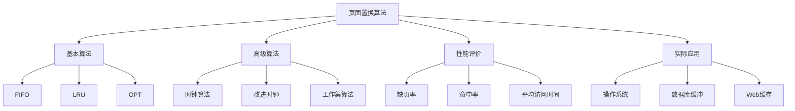

# 页面置换算法

## 1. 知识点概述

### 定义和基本概念
页面置换算法是虚拟内存管理的核心组成部分，当内存中没有足够空间装入新页面时，需要选择一个页面换出到外存，为新页面腾出空间。好的置换算法能够降低缺页率，提高系统性能。

### 在考试中的重要性 ⭐⭐⭐⭐⭐
- **高频考点**：408考试内存管理模块的重点
- **分值占比**：通常占内存管理40%以上分值
- **题型多样**：算法模拟、性能计算、缺页率分析
- **实用性强**：直接影响系统运行效率

### 与其他知识点的关联
- 基于虚拟内存管理机制
- 与局部性原理密切相关
- 影响系统整体性能
- 关联Cache替换算法

## 2. 理论基础

### 虚拟内存基础
- **页面调入**：从外存读取页面到内存
- **页面换出**：将内存页面写回外存
- **缺页中断**：访问不在内存中的页面时产生
- **工作集**：进程在某段时间内访问的页面集合

### 性能评价指标
- **缺页率**：缺页次数/总访问次数
- **命中率**：命中次数/总访问次数 = 1 - 缺页率
- **平均访问时间**：考虑缺页代价的访问时间

## 3. 主要置换算法 🔥

### 3.1 最佳置换算法（OPT）

#### 算法原理
选择未来最长时间不再被访问的页面进行置换。

#### 算法特点
- **理论最优**：缺页率最低
- **实际不可实现**：无法预知未来访问序列
- **作为基准**：用于评价其他算法性能

### 3.2 先进先出算法（FIFO）

#### 算法原理
选择最早进入内存的页面进行置换。

#### 实现方式
使用队列记录页面进入顺序，队首页面最先被置换。

#### 算法特点
- **实现简单**：只需维护进入时间
- **不考虑访问特性**：可能置换频繁使用的页面
- **Belady异常**：增加物理块数可能导致缺页率上升

### 3.3 最近最少使用算法（LRU）

#### 算法原理
选择最近最长时间没有被访问的页面进行置换。

#### 实现方式
1. **计数器方式**：记录每页最后访问时间
2. **栈方式**：维护访问页面的栈
3. **链表方式**：最近访问的页面移到链表头

#### 算法特点
- **性能优秀**：接近OPT算法
- **实现复杂**：需要额外的时间和空间开销
- **无Belady异常**：单调性好

### 3.4 时钟算法（Clock/二次机会）

#### 算法原理
使用环形链表和访问位，给每个页面第二次机会。

#### 实现步骤
1. 检查指针指向页面的访问位
2. 若为0，选择该页面置换
3. 若为1，置为0，指针前移，继续查找

#### 算法特点
- **LRU的近似**：性能接近LRU
- **实现简单**：只需要一个访问位
- **开销较小**：适合实际系统实现

### 3.5 改进时钟算法

#### 算法原理
同时考虑访问位和修改位，优先选择未访问且未修改的页面。

#### 优先级顺序
1. (访问位=0, 修改位=0)：最佳选择
2. (访问位=0, 修改位=1)：需要写回
3. (访问位=1, 修改位=0)：最近被访问
4. (访问位=1, 修改位=1)：最近被访问且修改

## 4. 典型例题解析

### 例题1：基本算法比较 ⭐⭐⭐⭐⭐

**题目描述：**
某系统分配给进程3个物理块，页面访问序列为：1,2,3,4,1,2,5,1,2,3,4,5
分别用FIFO、LRU、OPT算法计算缺页次数。

**解题思路：**
1. 逐步模拟页面访问过程
2. 记录每次的页面置换情况
3. 统计总缺页次数

**详细解答：**

**FIFO算法模拟：**
```
访问序列: 1 2 3 4 1 2 5 1 2 3 4 5
物理块1:  1 1 1 4 4 4 5 5 5 3 3 3
物理块2:    2 2 2 1 1 1 1 1 1 4 4
物理块3:      3 3 3 2 2 2 2 2 2 5
缺页标记: * * * * * * * - - * * *

缺页次数：9次
```

**LRU算法模拟：**
```
访问序列: 1 2 3 4 1 2 5 1 2 3 4 5
物理块1:  1 1 1 4 1 1 1 1 1 3 4 4
物理块2:    2 2 2 2 2 5 5 5 5 5 5
物理块3:      3 3 3 3 3 3 3 2 2 2
缺页标记: * * * * - - * - - * * *

缺页次数：8次
```

**OPT算法模拟：**
```
访问序列: 1 2 3 4 1 2 5 1 2 3 4 5
物理块1:  1 1 1 1 1 1 1 1 1 3 4 5
物理块2:    2 2 2 2 2 5 5 5 5 5 5
物理块3:      3 4 4 4 4 4 4 2 2 2
缺页标记: * * * * - - * - - * * *

缺页次数：7次
```

**关键点总结：**
- OPT算法性能最优但不可实现
- LRU算法性能良好，实际常用
- FIFO算法简单但可能性能较差

### 例题2：Belady异常现象 ⭐⭐⭐⭐

**题目描述：**
页面访问序列：1,2,3,4,1,2,5,1,2,3,4,5
分别分析分配3个和4个物理块时FIFO算法的缺页情况。

**解题思路：**
1. 分别模拟3块和4块的情况
2. 比较缺页次数
3. 验证Belady异常

**详细解答：**

**3个物理块（前面已计算）：缺页9次**

**4个物理块的FIFO算法：**
```
访问序列: 1 2 3 4 1 2 5 1 2 3 4 5
物理块1:  1 1 1 1 1 1 5 5 5 5 4 4
物理块2:    2 2 2 2 2 2 1 1 1 1 1
物理块3:      3 3 3 3 3 3 3 2 2 2
物理块4:        4 4 4 4 4 4 4 3 3
缺页标记: * * * * - - * * * * * *

缺页次数：10次
```

**分析：**
物理块从3个增加到4个，缺页次数从9次增加到10次，出现了Belady异常现象。

### 例题3：工作集模型 ⭐⭐⭐⭐

**题目描述：**
给定页面访问序列和工作集窗口大小，计算各时刻的工作集大小。

访问序列：1,2,1,3,2,4,1,3,2,3,1,2
工作集窗口：Δ = 4

**解题思路：**
1. 理解工作集定义
2. 维护滑动窗口
3. 统计窗口内不同页面数

**详细解答：**
```
时刻  访问页面  工作集窗口    工作集     工作集大小
1     1        [1]          {1}        1
2     2        [1,2]        {1,2}      2
3     1        [1,2,1]      {1,2}      2
4     3        [1,2,1,3]    {1,2,3}    3
5     2        [2,1,3,2]    {1,2,3}    3
6     4        [1,3,2,4]    {1,2,3,4}  4
7     1        [3,2,4,1]    {1,2,3,4}  4
8     3        [2,4,1,3]    {1,2,3,4}  4
9     2        [4,1,3,2]    {1,2,3,4}  4
10    3        [1,3,2,3]    {1,2,3}    3
11    1        [3,2,3,1]    {1,2,3}    3
12    2        [2,3,1,2]    {1,2,3}    3
```

## 5. 解题方法总结

### 解题思路框架
```
1. 理解算法原理 → 掌握置换规则
2. 初始化状态 → 设置物理块
3. 逐步模拟 → 按访问序列处理
4. 记录置换 → 标记缺页和置换
5. 统计结果 → 计算缺页率等指标
```

### 关键步骤
1. **页面访问检查**：是否在内存中
2. **空闲块分配**：有空闲块直接分配
3. **页面置换**：按算法选择牺牲页面
4. **状态更新**：更新内存状态和辅助信息

### 常用技巧
- **表格法**：用表格记录模拟过程
- **标记法**：用符号标记缺页和命中
- **辅助信息**：维护必要的时间戳或计数器

## 6. 知识点关联图



掌握页面置换算法是理解虚拟内存管理的关键，也是操作系统性能优化的重要手段！