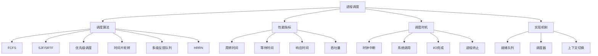

# 进程调度算法

## 1. 知识点概述

### 定义和基本概念
进程调度是操作系统内核的一个核心功能，负责决定在任意时刻哪个进程应该占用CPU。调度算法直接影响系统的响应时间、吞吐量和资源利用率，是操作系统性能的关键决定因素。

### 在考试中的重要性 ⭐⭐⭐⭐⭐
- **超高频考点**：几乎每年必考，是408操作系统最重要的知识点
- **分值占比**：通常占进程管理模块50%以上的分值
- **题型多样**：算法模拟、性能计算、设计分析等
- **综合性强**：与进程状态、同步互斥等知识紧密关联

### 与其他知识点的关联
- 与进程状态转换密切相关
- 影响系统的整体性能表现
- 关联内存管理和I/O管理
- 与实时系统设计相关

## 2. 理论基础

### 调度的基本概念

#### 调度层次
1. **高级调度（作业调度）**：决定哪些作业进入系统
2. **中级调度（内存调度）**：决定哪些进程调入内存
3. **低级调度（进程调度）**：决定哪个就绪进程获得CPU

#### 调度时机
- 当前进程执行完毕或终止
- 当前进程由于I/O请求而阻塞
- 当前进程由运行态转为就绪态
- 当前进程从阻塞态转为就绪态

#### 调度方式
- **非抢占式调度**：进程主动放弃CPU
- **抢占式调度**：系统强制收回CPU

### 调度性能指标

#### 1. CPU利用率（CPU Utilization）
```
CPU利用率 = (CPU忙碌时间 / 总时间) × 100%
```

#### 2. 吞吐量（Throughput）
```
吞吐量 = 单位时间内完成的进程数
```

#### 3. 周转时间（Turnaround Time）
```
周转时间 = 进程完成时间 - 进程提交时间
平均周转时间 = Σ周转时间 / 进程数
```

#### 4. 等待时间（Waiting Time）
```
等待时间 = 周转时间 - 运行时间
平均等待时间 = Σ等待时间 / 进程数
```

#### 5. 响应时间（Response Time）
```
响应时间 = 首次响应时间 - 进程提交时间
```

#### 6. 响应比（Response Ratio）
```
响应比 = (等待时间 + 服务时间) / 服务时间
```

## 3. 主要调度算法 🔥

### 3.1 先来先服务（FCFS）

#### 算法原理
按照进程到达的先后顺序进行调度，最简单的调度算法。

#### 算法特点
- **优点**：公平、简单、易于实现
- **缺点**：平均等待时间长，不利于短进程
- **调度方式**：非抢占式

#### 算法实现
```
1. 维护一个按到达时间排序的就绪队列
2. 总是选择队首进程执行
3. 进程执行完毕后，调度下一个进程
```

### 3.2 短作业优先（SJF）

#### 算法原理
优先调度预计执行时间最短的进程，以最小化平均等待时间。

#### 算法变体
- **非抢占式SJF**：进程开始执行后不被抢占
- **抢占式SJF（SRTF）**：更短进程到达时抢占当前进程

#### 算法特点
- **优点**：平均等待时间最短（理论最优）
- **缺点**：可能产生饥饿现象，难以预测执行时间
- **适用场景**：批处理系统

### 3.3 优先级调度

#### 算法原理
为每个进程分配优先级，优先调度优先级最高的进程。

#### 优先级分配
- **静态优先级**：进程创建时分配，运行期间不变
- **动态优先级**：根据进程行为动态调整

#### 优先级类型
- **抢占式优先级调度**：高优先级进程可以抢占CPU
- **非抢占式优先级调度**：等待当前进程完成

#### 防止饥饿
- **老化技术**：随时间增加进程优先级
- **时间片轮转**：结合时间片机制

### 3.4 时间片轮转（RR）

#### 算法原理
为每个进程分配相等的时间片，进程在时间片内执行，时间片用完后被调度到队尾。

#### 关键参数
- **时间片大小（Time Quantum）**：决定系统的响应性和开销

#### 时间片选择原则
- **过小**：频繁切换，开销大
- **过大**：响应时间长，退化为FCFS
- **经验值**：10-100ms

#### 算法特点
- **优点**：响应时间好，公平性强
- **缺点**：不利于长进程，上下文切换开销
- **适用场景**：分时系统

### 3.5 多级反馈队列（MFQ）

#### 算法原理
设置多个优先级不同的就绪队列，新进程进入最高优先级队列，根据执行行为在队列间移动。

#### 典型设计
```
队列0（最高优先级）：时间片 = 8ms
队列1（中等优先级）：时间片 = 16ms  
队列2（最低优先级）：FCFS调度
```

#### 调度规则
1. 优先调度高优先级队列中的进程
2. 同一队列内采用时间片轮转
3. 进程用完时间片后降级到下一队列
4. I/O完成后进程升级到上一队列

#### 算法特点
- **优点**：兼顾响应时间和周转时间，自适应性强
- **缺点**：实现复杂，参数调整困难
- **适用场景**：通用操作系统

### 3.6 最高响应比优先（HRRN）

#### 算法原理
选择响应比最高的进程执行，综合考虑等待时间和服务时间。

#### 响应比计算
```
响应比 = (等待时间 + 服务时间) / 服务时间
      = 1 + 等待时间 / 服务时间
```

#### 算法特点
- **优点**：兼顾短作业和长作业，防止饥饿
- **缺点**：需要预知服务时间，计算开销大
- **调度方式**：非抢占式

## 4. 重难点分析

### 常见误区和易错点 ⚠️

#### 误区1：时间计算错误
**错误做法**：忽略进程到达时间的影响
**正确方法**：
- 开始时间 = max(到达时间, 前一进程结束时间)
- 周转时间 = 完成时间 - 到达时间

#### 误区2：抢占判断错误
**常见错误**：不清楚何时发生抢占
**判断要点**：
- 新进程到达时检查是否需要抢占
- 时间片用完时进行调度
- 进程阻塞或终止时进行调度

#### 误区3：队列管理错误
**错误理解**：多级队列的进程移动规则不清
**正确理解**：
- 明确各队列的调度策略
- 理解进程在队列间的移动条件
- 注意优先级的动态调整

### 深入理解要点

#### 1. 调度算法的选择依据
- **系统类型**：批处理、分时、实时系统
- **工作负载**：CPU密集型、I/O密集型、交互型
- **性能目标**：吞吐量、响应时间、公平性

#### 2. 抢占的时机和代价
- **抢占时机**：时钟中断、系统调用、I/O完成
- **上下文切换代价**：寄存器保存、页表切换、Cache失效
- **频率控制**：平衡响应性和效率

#### 3. 实际系统的调度策略
- **Linux CFS**：完全公平调度器
- **Windows调度**：多级反馈队列
- **实时系统**：优先级调度、截止时间调度

### 记忆技巧 💡

#### 1. 算法特点记忆
- **FCFS**："先来后到，简单公平，短作业吃亏"
- **SJF**："短者优先，平均最优，饥饿可能"
- **RR**："轮流执行，响应良好，开销较大"
- **MFQ**："多级队列，综合最佳，复杂实现"

#### 2. 性能指标记忆
"周转包含等待，响应重视首次，吞吐关注效率"

#### 3. 计算步骤记忆
"画甘特图，算时间，求平均，比优劣"

## 5. 典型例题解析

### 例题1：基本调度算法比较 ⭐⭐⭐⭐⭐

**题目描述：**
有4个进程，到达时间和服务时间如下表。分别用FCFS、SJF、RR(时间片=2)算法调度，计算平均周转时间和平均等待时间。

| 进程 | 到达时间 | 服务时间 |
|------|---------|---------|
| P1   | 0       | 8       |
| P2   | 1       | 4       |
| P3   | 2       | 9       |
| P4   | 3       | 5       |

**解题思路：**
1. 绘制甘特图
2. 计算各进程的完成时间
3. 计算周转时间和等待时间
4. 求平均值并比较

**详细解答：**

**FCFS算法：**
```
甘特图：
|  P1  |  P2  |  P3  |  P4  |
0      8     12     21     26

完成时间：P1=8, P2=12, P3=21, P4=26
周转时间：P1=8-0=8, P2=12-1=11, P3=21-2=19, P4=26-3=23
等待时间：P1=0, P2=8-1=7, P3=12-2=10, P4=21-3=18

平均周转时间 = (8+11+19+23)/4 = 15.25
平均等待时间 = (0+7+10+18)/4 = 8.75
```

**SJF算法（非抢占）：**
```
按服务时间排序：P2(4), P4(5), P1(8), P3(9)
考虑到达时间的调度顺序：P1→P2→P4→P3

甘特图：
|  P1  |  P2  |  P4  |  P3  |
0      8     12     17     26

完成时间：P1=8, P2=12, P4=17, P3=26
周转时间：P1=8, P2=11, P4=14, P3=24
等待时间：P1=0, P2=7, P4=9, P3=15

平均周转时间 = (8+11+14+24)/4 = 14.25
平均等待时间 = (0+7+9+15)/4 = 7.75
```

**RR算法（时间片=2）：**
```
甘特图：
|P1|P2|P3|P4|P1|P2|P3|P4|P1|P3|P4|P1|P3|P3|P3|
0 2 4 6 8 10 12 14 16 18 20 22 24 26 28 30

详细执行过程：
0-2: P1(剩余6)    8-10: P1(剩余4)   16-18: P1(剩余2)   24-26: P1(完成)
2-4: P2(剩余2)    10-12: P2(完成)   18-20: P3(剩余5)   26-28: P3(剩余3)
4-6: P3(剩余7)    12-14: P3(剩余5)  20-22: P4(剩余1)   28-30: P3(剩余1)
6-8: P4(剩余3)    14-16: P4(剩余1)  22-24: P4(完成)    30-31: P3(完成)

完成时间：P1=26, P2=12, P3=31, P4=22
周转时间：P1=26, P2=11, P3=29, P4=19
等待时间：P1=18, P2=7, P3=20, P4=14

平均周转时间 = (26+11+29+19)/4 = 21.25
平均等待时间 = (18+7+20+14)/4 = 14.75
```

**关键点总结：**
- SJF算法平均性能最好，但可能导致长进程饥饿
- RR算法响应时间好，但平均性能不如SJF
- FCFS算法最简单，但性能一般

### 例题2：多级反馈队列调度 ⭐⭐⭐⭐⭐

**题目描述：**
某系统采用三级反馈队列调度：
- Q0：时间片=1，优先级最高
- Q1：时间片=2，优先级中等
- Q2：FCFS，优先级最低

进程信息：P1(到达0，服务5)，P2(到达1，服务3)，P3(到达2，服务1)
模拟调度过程并计算平均周转时间。

**解题思路：**
1. 理解多级队列的调度规则
2. 逐时刻模拟调度过程
3. 记录进程在各队列间的移动
4. 计算性能指标

**详细解答：**

**调度规则：**
- 新进程进入Q0
- 时间片用完降级到下一队列
- 优先调度高优先级队列

**模拟过程：**
```
时刻0: P1进入Q0
时刻0-1: 执行P1(Q0)，P1剩余4，降级到Q1

时刻1: P2进入Q0，队列状态：Q0=[P2], Q1=[P1]
时刻1-2: 执行P2(Q0)，P2剩余2，降级到Q1

时刻2: P3进入Q0，队列状态：Q0=[P3], Q1=[P1,P2]
时刻2-3: 执行P3(Q0)，P3完成

时刻3: Q0空，调度Q1中的P1
时刻3-5: 执行P1(Q1)，P1剩余2，降级到Q2

时刻5: 调度Q1中的P2
时刻5-7: 执行P2(Q1)，P2完成

时刻7: 调度Q2中的P1
时刻7-9: 执行P1(Q2)，P1完成

甘特图：
|P1|P2|P3|P1 |P2 |P1 |
0  1  2  3   5   7   9

完成时间：P1=9, P2=7, P3=3
周转时间：P1=9, P2=6, P3=1
平均周转时间 = (9+6+1)/3 = 5.33
```

**关键点总结：**
- 短进程（P3）获得快速响应
- 长进程（P1）逐级降级但仍能完成
- 多级队列兼顾了响应时间和公平性

### 例题3：最高响应比优先算法 ⭐⭐⭐⭐

**题目描述：**
用HRRN算法调度以下进程，计算调度顺序和平均周转时间。

| 进程 | 到达时间 | 服务时间 |
|------|---------|---------|
| P1   | 0       | 3       |
| P2   | 2       | 6       |
| P3   | 4       | 4       |
| P4   | 6       | 5       |
| P5   | 8       | 2       |

**解题思路：**
1. 按时间顺序进行调度决策
2. 每次调度时计算所有就绪进程的响应比
3. 选择响应比最高的进程执行
4. 重复直到所有进程完成

**详细解答：**

**时刻0：** 只有P1就绪，调度P1
时刻0-3：执行P1，P1完成

**时刻3：** P2已就绪，调度P2
时刻3-9：执行P2，P2完成

**时刻9：** P3、P4、P5都已就绪，计算响应比
```
P3: 响应比 = (等待时间5 + 服务时间4) / 服务时间4 = 2.25
P4: 响应比 = (等待时间3 + 服务时间5) / 服务时间5 = 1.6  
P5: 响应比 = (等待时间1 + 服务时间2) / 服务时间2 = 1.5
```
选择P3执行
时刻9-13：执行P3，P3完成

**时刻13：** P4、P5就绪，计算响应比
```
P4: 响应比 = (等待时间7 + 服务时间5) / 服务时间5 = 2.4
P5: 响应比 = (等待时间5 + 服务时间2) / 服务时间2 = 3.5
```
选择P5执行
时刻13-15：执行P5，P5完成

**时刻15：** 只有P4就绪，调度P4
时刻15-20：执行P4，P4完成

**甘特图：**
```
|  P1  |    P2    |  P3  |P5|   P4   |
0      3          9     13 15      20

完成时间：P1=3, P2=9, P3=13, P4=20, P5=15
周转时间：P1=3, P2=7, P3=9, P4=14, P5=7
平均周转时间 = (3+7+9+14+7)/5 = 8
```

**关键点总结：**
- HRRN算法综合考虑等待时间和服务时间
- 能够避免短作业和长作业的饥饿问题
- 响应比随等待时间增加而增加，保证公平性

## 6. 解题方法总结

### 解题思路框架

#### 调度算法模拟题
```
1. 理解算法 → 掌握调度规则和特点
2. 建立时间轴 → 确定关键时间点
3. 逐步模拟 → 按时间顺序进行调度
4. 绘制甘特图 → 可视化执行过程
5. 计算指标 → 周转时间、等待时间等
6. 分析比较 → 评估算法性能
```

#### 性能计算题
```
1. 提取信息 → 到达时间、服务时间
2. 确定顺序 → 根据算法确定执行顺序
3. 计算时间 → 开始、完成、周转、等待时间
4. 求平均值 → 各项性能指标的平均值
5. 对比分析 → 不同算法的优劣比较
```

### 关键计算公式

#### 1. 基本时间计算
```
开始时间 = max(到达时间, 前一进程结束时间)
完成时间 = 开始时间 + 服务时间
周转时间 = 完成时间 - 到达时间
等待时间 = 周转时间 - 服务时间
响应时间 = 首次调度时间 - 到达时间
```

#### 2. 平均性能指标
```
平均周转时间 = Σ周转时间 / 进程数
平均等待时间 = Σ等待时间 / 进程数
平均响应时间 = Σ响应时间 / 进程数
```

#### 3. 响应比计算
```
响应比 = (等待时间 + 服务时间) / 服务时间
```

### 时间分配建议
- 基本算法模拟：8-12分钟
- 多级队列调度：10-15分钟
- 性能比较分析：5-8分钟

## 7. 相关真题练习

### 历年真题选编

#### 真题1（2020年）
某系统采用时间片轮转调度，时间片为4个时间单位，给定进程序列，计算平均周转时间。

**解题要点**：
- 严格按照时间片轮转的规则
- 注意进程的到达时间差异
- 正确计算各时间指标

#### 真题2（2019年）
比较FCFS、SJF、HRRN三种算法在给定进程集合下的性能差异。

**解题要点**：
- 分别模拟三种算法
- 计算相同的性能指标
- 分析各算法的优缺点

#### 真题3（2021年）
设计一个多级反馈队列调度算法，并分析其对不同类型进程的调度效果。

**解题要点**：
- 明确各级队列的特点
- 设计合理的升降级规则
- 分析对I/O密集型和CPU密集型进程的影响

### 模拟题推荐

#### 基础练习
1. 基本调度算法的模拟计算
2. 简单的性能指标计算
3. 抢占和非抢占调度的区别

#### 进阶练习
1. 复杂的多级反馈队列设计
2. 实时调度算法的应用
3. 调度算法的性能优化

#### 综合应用
1. 根据系统特点选择合适的调度算法
2. 调度算法在实际操作系统中的实现
3. 多处理器系统的调度策略

### 自测练习

#### 快速自测题
1. 哪种调度算法的平均等待时间最短？
2. 时间片轮转算法如何防止饥饿？
3. 多级反馈队列的主要优势是什么？

#### 计算自测题
1. 模拟一个简单的SJF调度过程
2. 计算给定进程集合的HRRN调度
3. 设计一个三级反馈队列的调度方案

**答案要点**：
1. SJF算法（理论最优）
2. 给每个进程相等的时间片机会
3. 兼顾响应时间和周转时间，适应性强

## 8. 知识点关联图



### 核心概念关联
- **进程状态** ← 调度算法 → **系统性能**
- **时间管理** ← 调度时机 → **资源分配**
- **公平性** ← 调度策略 → **效率优化**

### 实际应用关联
- **操作系统内核**：进程调度器实现
- **数据库系统**：事务调度
- **Web服务器**：请求调度
- **云计算平台**：任务调度

---

掌握进程调度算法是理解操作系统资源管理的核心。通过深入学习各种调度算法的原理、特点和适用场景，您将具备分析和设计高效进程调度系统的能力！